# AegisLog – Progress Log (2026-03-14)

## High-level decisions

- Defined AegisLog as an **AI-powered log triage assistant** focused on authentication and web access logs, distinct from SentinelTI (URL reputation).
- Chosen approach:
  - Unsupervised anomaly detection (Isolation Forest) on per-session / per-IP behavioral features.
  - Future clustering of anomalies into incidents.
  - Future LLM-based incident explanations and categorization with a security flavor (credential stuffing, scanning, misconfig, etc.).

## README and project positioning

- Wrote a detailed **Features** section emphasizing:
  - Log ingestion and normalization.
  - Session/IP behavior modeling.
  - Unsupervised anomaly detection.
  - Incident clustering.
  - LLM-powered explanations and security-focused behaviors.
  - Triage workflow, feedback loop, CLI + FastAPI API, and experiment tracking.
- Clarified how AegisLog is **different from SentinelTI** in domain, ML style, AI use, and UX.

## Code structure and setup

- Confirmed basic package layout:
  - `aegislog/` with `cli.py`, `api.py`, `parsing/`, `features/`, `ml/`, etc.
- Verified virtual environment setup and ensured `aegislog` is importable.
- Fixed uvicorn import issues by:
  - Ensuring `aegislog/__init__.py` exists.
  - Running uvicorn from the project root with `python -m uvicorn aegislog.api:app --reload`.

## Anomaly engine (first end-to-end slice)

### Data model and parsing

- Added `LogEvent` and `Session` dataclasses in `aegislog/features/sessions.py` to standardize event and session representation.
- Implemented Apache-style access log parsing in `aegislog/parsing/access.py`:
  - Regex-based `parse_access_line`.
  - `parse_access_file(path)` returning a list of `LogEvent` objects.
- Created a small `data/sample_access.log` file with synthetic access log entries for testing.

### Sessionization

- Implemented `build_sessions(events, gap_minutes=30)` in `features/sessions.py`:
  - Sorts events by `(ip, user, user_agent, timestamp)`.
  - Groups events into sessions, splitting on identity changes or time gaps > configured threshold.
  - Produces `Session` objects with `session_id`, `ip`, `user`, `user_agent`, and event list.

### Feature extraction

- Implemented `sessions_to_features` in `aegislog/features/behavioral.py`:
  - For each session, computes:
    - `event_count`
    - `duration_seconds`
    - `status_4xx`
    - `status_5xx`
    - `error_ratio` (4xx+5xx over total events)
  - Returns a pandas DataFrame with one row per session and these numeric features.

### Isolation Forest model and training

- Implemented `build_pipeline` in `aegislog/ml/pipeline.py`:
  - Uses a `ColumnTransformer` + `StandardScaler` over numeric features.
  - Uses `IsolationForest` (unsupervised) with configurable `contamination`.
- Created `aegislog/ml/train.py`:
  - CLI-style script:
    - Parses `--logs-path` and `--model-path`.
    - `parse_access_file` → `build_sessions` → `sessions_to_features`.
    - Fits the Isolation Forest pipeline on the resulting DataFrame.
    - Saves the trained model to `models/log_anomaly_iforest.joblib`.
  - Verified training runs successfully using `data/sample_access.log`.

### Scoring and CLI analyze command

- Extended `ml/pipeline.py` with:
  - `load_model(model_path)` to load the saved pipeline.
  - `score_sessions(sessions, model_path)` to:
    - Build features.
    - Run `decision_function` on the Isolation Forest.
    - Store `anomaly_score = -decision_function` (higher = more anomalous).
- Updated `aegislog/cli.py`:
  - Added `analyze` subcommand:
    - Parses a log file.
    - Runs parsing → sessionization → scoring.
    - Sorts sessions by `anomaly_score` descending.
    - Prints the top N anomalous sessions with basic info (session_id, ip, user, event_count, error_ratio, anomaly_score).
  - Verified end-to-end flow:
    - `python -m aegislog.ml.train --logs-path data/sample_access.log`
    - `python -m aegislog.cli analyze data/sample_access.log --top 3`

## Git / version control

- Initialized git repository (if not already).
- Suggested commit messages:
  - `Add Isolation Forest scoring helper for sessions` (for `ml/pipeline.py` changes).
  - `Add analyze command to score log sessions` (for `cli.py` changes).

## Next steps (future work)

- Enrich behavioral features (failed vs successful logins, path patterns, time-of-day signals).
- Introduce anomaly clustering to convert sessions into incidents.
- Design and implement the LLM-based incident explainer and categories.
- Add FastAPI endpoints that wrap the same detection pipeline.
- Start a Pytest suite for parsing, sessionization, feature extraction, and scoring.


# AegisLog – Progress Log (2026-03-15)

## Dataset choices

- Decided to use **Loghub** datasets as primary data sources for realistic logs: https://github.com/logpai/loghub
  - Apache error logs for web server behavior.
  - OpenSSH / SSH logs for authentication behavior.
- Downloaded and added Loghub files locally under `data/loghub/`:
  - `data/loghub/Apache.log` (Apache error log).
  - `data/loghub/SSH.log` (large SSH log, kept local; sample planned for the repo).
- Noted that `SSH.log` (~69 MB) exceeded GitHub’s recommended size:
  - GitHub accepted the push but warned about file size.
  - Plan: keep a smaller `SSH_sample.log` in the repo and ignore the large raw file via `.gitignore`.

## Apache error log parsing

- Recognized that Loghub’s Apache dataset is an **error log**, not an HTTP access log.
- Implemented a dedicated Apache error-log parser in `aegislog/parsing/apache_error.py`:
  - `parse_error_line(line)`:
    - Parses lines like `[Thu Jun 09 06:07:04 2005] [notice] ...`.
    - Extracts timestamp and log level (`notice`, `error`, etc.).
    - Stores log level temporarily in `LogEvent.user_agent` (to be used as a feature).
  - `parse_error_file(path)`:
    - Reads the file and converts each line into a `LogEvent` with:
      - `timestamp`, `level` (via `user_agent`), `source="apache_error"`, and raw text.
- Updated training and CLI paths to use `parse_error_file` when working with `data/loghub/Apache.log`.

## Session feature engineering

- Extended `aegislog/features/behavioral.py` to compute richer per-session features using Apache error logs:
  - Existing features:
    - `event_count` – number of events in the session.
    - `duration_seconds` – time difference between first and last event.
    - `status_4xx`, `status_5xx` – HTTP status buckets (usually empty for error logs).
    - `error_ratio` – (4xx + 5xx) / total events.
  - New features based on log levels:
    - `error_events` – count of events with level `"error"`.
    - `notice_events` – count of events with level `"notice"`.
    - `error_event_ratio` – `error_events / event_count`.
  - Ensured `sessions_to_features` returns a DataFrame with:
    - `session_id`, `ip`, `user`, `event_count`, `duration_seconds`,
      `status_4xx`, `status_5xx`, `error_ratio`,
      `error_events`, `notice_events`, `error_event_ratio`.

## ML pipeline updates

- Updated `aegislog/ml/pipeline.py`:
  - Extended `NUMERIC_FEATURES` to include the new error-level features:
    - `["event_count", "duration_seconds", "status_4xx", "status_5xx", "error_ratio",
       "error_events", "notice_events", "error_event_ratio"]`.
  - Kept the Isolation Forest pipeline structure:
    - `ColumnTransformer` + `StandardScaler` over numeric features.
    - `IsolationForest` with fixed `random_state` and configurable `contamination`.
  - Confirmed alignment between `NUMERIC_FEATURES` and columns produced by `sessions_to_features`.

## Training and analysis on Loghub Apache

- Successfully trained a model on Loghub Apache error logs:

  ```bash
  python -m aegislog.ml.train --logs-path "data/loghub/Apache.log" --model-path models/log_anomaly_iforest_apache.joblib

  python -m aegislog.cli analyze "data/loghub/Apache.log" --model-path models/log_anomaly_iforest_apache.joblib --top 5


# AegisLog – Progress Log (2026-03-17)

## SSH authentication parsing and pipeline integration

- Implemented a dedicated SSH/authentication parser (`parsing/auth_ssh.py`) for Loghub SSH logs:
  - Parses standard OpenSSH-style lines like:
    - `Dec 10 06:55:46 LabSZ sshd[24200]: Failed password for invalid user webmaster from 173.234.31.186 port 38926 ssh2`
  - Extracts:
    - `timestamp` (assumed year 2005 for ordering),
    - `ip` from the `from <ip>` portion,
    - `user` when present in patterns like `user <name>`,
    - `status` as a simple auth outcome:
      - `401` for “Failed password …” lines,
      - `200` for “Accepted password …” lines,
    - `source="ssh_auth"` to distinguish from other log types.

- Verified that the SSH parser works by:
  - Loading `data/loghub/SSH.log`:
    - ~655k events parsed into `LogEvent` objects.
  - Building sessions (`build_sessions`) and features (`sessions_to_features`) on top of these events:
    - ~18k sessions created.
    - Confirmed feature columns include:
      - `event_count`, `duration_seconds`,
      - `status_4xx`, `status_5xx`, `error_ratio`,
      - `error_events`, `notice_events`, `error_event_ratio`,
      - plus new auth-specific fields.

## SSH-specific behavioral features

- Extended `sessions_to_features` in `features/behavioral.py` with SSH/auth features:
  - `auth_failed` – count of events with `status == 401` in the session.
  - `auth_success` – count of events with `status == 200`.
  - `auth_fail_ratio` – `auth_failed / (auth_failed + auth_success)` when there are any auth events.
- These features are designed to highlight suspicious auth behavior such as:
  - Sessions with only failures (`auth_fail_ratio` close to 1).
  - Sessions with many failures before a success (potential brute-force or credential stuffing).

## ML pipeline updates for multi-log support

- Updated `ml/pipeline.py` to include the new SSH features in the numeric feature set:
  - `NUMERIC_FEATURES` now includes:
    - `event_count`, `duration_seconds`,
      `status_4xx`, `status_5xx`, `error_ratio`,
      `error_events`, `notice_events`, `error_event_ratio`,
      `auth_failed`, `auth_success`, `auth_fail_ratio`.
- Modified `ml/train.py` to accept a `--log-type` flag:
  - `--log-type apache_error` → uses `parse_error_file` for Loghub Apache error logs.
  - `--log-type ssh_auth` → uses `parse_ssh_file` for Loghub SSH logs.
- Trained and saved separate models:
  - Apache error log model:
    - `python -m aegislog.ml.train --logs-path data/loghub/Apache.log --log-type apache_error --model-path models/log_anomaly_iforest_apache.joblib`
  - SSH auth model:
    - `python -m aegislog.ml.train --logs-path data/loghub/SSH.log --log-type ssh_auth --model-path models/log_anomaly_iforest_ssh.joblib`

## CLI support for Apache and SSH

- Updated `cli.py` `analyze` command to accept a `--log-type` flag:
  - `--log-type apache_error`:
    - Parses `Apache.log` via the Apache error parser.
    - Scores sessions with the Apache Isolation Forest model.
  - `--log-type ssh_auth`:
    - Parses `SSH.log` via the SSH auth parser.
    - Scores sessions with the SSH Isolation Forest model.
- Verified both flows:
  - Apache:
    - `python -m aegislog.cli analyze data/loghub/Apache.log --log-type apache_error --model-path models/log_anomaly_iforest_apache.joblib --top 3`
  - SSH:
    - `python -m aegislog.cli analyze data/loghub/SSH.log --log-type ssh_auth --model-path models/log_anomaly_iforest_ssh.joblib --top 3`
  - Confirmed that SSH output shows high-event sessions per IP with `error_ratio` and anomaly scores.

## README updates

- Added a **Datasets** section describing the use of Loghub:
  - Apache error logs for web server error behavior.
  - SSH authentication logs for auth behavior (failed/successful logins).
  - Noted that only small samples are stored in the repo; full datasets are expected to be downloaded locally.

## Overall status

- AegisLog now supports:
  - Apache error logs and SSH authentication logs from Loghub.
  - Session-based feature extraction with both error-level and auth-specific metrics.
  - Separate Isolation Forest models for different log types.
  - A CLI that can analyze both Apache and SSH logs with a `--log-type` switch.

  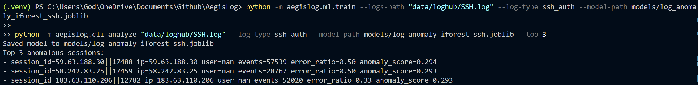

- Next steps:
  - Refine SSH features (e.g., per-IP vs per-user session definitions).
  - Start grouping high-scoring sessions into simple incident clusters (e.g., per-IP incidents).
  - Design and implement the first version of the incident + explanation API.


# Progress Log

## 2026-03-18

### SSH session and incident enrichment

- Added SSH authentication statistics to session features, tracking failed and successful authentication attempts per session and exposing them to the anomaly scoring pipeline as `auth_failed` and `auth_success`.
- Updated IP-based incident aggregation to use authentication data:
  - Grouped sessions by source IP.
  - Aggregated total events, average anomaly score, total `auth_failed`, total `auth_success`, and computed an `auth_fail_ratio` per IP.
- Extended the `Incident` model to store:
  - `auth_failed`
  - `auth_success`
  - `auth_fail_ratio`
  so incidents carry security-relevant SSH auth context.

### CLI: incidents output with auth stats

- Enhanced the `incidents` CLI command to show SSH authentication statistics per incident:
  - Printed `auth_failed`, `auth_success`, and `auth_fail_ratio` in addition to existing fields such as `incident_id`, `ip`, `sessions`, `total_events`, and `avg_anomaly_score`.
- Confirmed that the top IP-based incidents surfaced in the CLI correspond to noisy SSH activity patterns consistent with brute-force attempts (high failed-auth counts, no successes).

---

## 2026-03-19

### Incident severity heuristic

- Extended the `Incident` dataclass with a `severity` field representing a simple textual risk level for each SSH incident.
- Implemented a `_compute_severity` helper function that derives severity from:
  - Average anomaly score.
  - Total failed authentication attempts.
  - Authentication failure ratio.
- Defined an initial heuristic:
  - Mark incidents with very high failed-auth counts, near-100% failure ratio, and elevated anomaly score as `"high"` severity.
  - Mark moderately suspicious auth behavior as `"medium"`.
  - Default remaining activity to `"low"`.

### CLI: severity in incidents output

- Updated `group_sessions_by_ip` to compute and attach a severity level for each IP-based incident using the aggregated SSH auth stats and anomaly scores.
- Enhanced the `incidents` CLI output format to include the new `severity` field:
  - Example output now includes:  
    `severity=<low|medium|high> sessions=... total_events=... auth_failed=... auth_success=... auth_fail_ratio=... avg_anomaly_score=...`
- Verified against `data/loghub/SSH.log` that top IP-based incidents with large numbers of failed SSH logins and zero successes are labeled as `severity=high`, matching expectations for brute-force style SSH scanning behavior.

## 2026-03-20

### AI-ready incident prompts

- Introduced a new `aegislog.ai` module that builds **LLM-ready prompts** for SSH incidents using structured incident data (IP, severity, events, auth stats, anomaly score) plus the existing human-written summary. The prompt guides an AI assistant to explain what is happening, assess brute-force behavior, and suggest next steps for a junior analyst.
- Defined an `LLMIncidentPrompt` dataclass and a `build_incident_llm_prompt()` helper that returns a complete incident explanation prompt string without making any external API calls, creating a clean integration surface for future LLM clients.
- Added an `explain_incident_with_llm()` placeholder that currently just echoes the prompt text, keeping logic for building prompts and invoking models clearly separated for future implementation.

### CLI: inspect LLM prompts for incidents

- Extended the `incidents` CLI command with a `--print-llm-prompt` flag; when enabled, the CLI prints a fully formatted, ready-to-send LLM prompt between `llm_prompt_begin` and `llm_prompt_end` for each top SSH incident. This makes it easy to copy/paste directly into an LLM for manual testing.
- Wired the AI helper into `cmd_incidents`: after printing the incident fields and rule-based summary, the command now optionally generates and displays the LLM prompt built from the same data, aligning with patterns used in recent work on LLM-based event log analysis and incident summarization.
- Manually validated the end-to-end flow by running the `incidents` command with `--print-llm-prompt` against `data/loghub/SSH.log`, confirming that high-severity brute-force style SSH incidents produce clear summaries and detailed prompts suitable for AI-driven explanations.

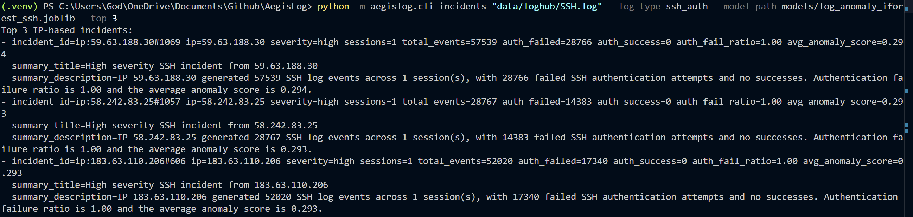

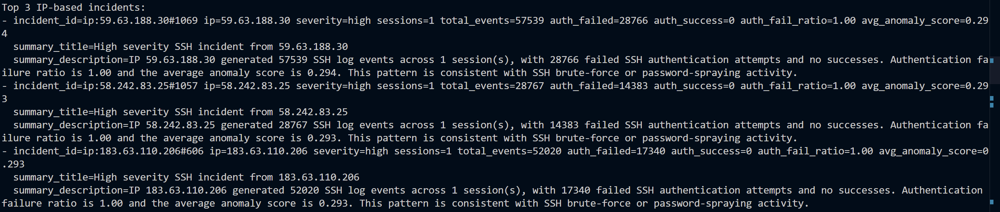

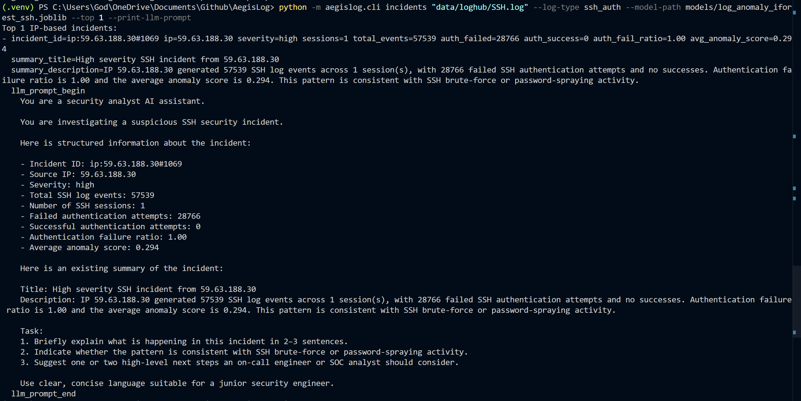

## 2026-03-21

### Incident time windows

- Extended the `Incident` model to record `first_seen` and `last_seen` timestamps for each SSH incident, giving every IP-based incident a clear time window. This follows common SIEM and threat-modeling patterns that track when suspicious activity starts and ends to support investigations and correlation.
- Updated the incident aggregation logic to derive `first_seen` and `last_seen` by scanning all events in the sessions associated with each IP, so the time bounds accurately reflect the observed SSH activity rather than a single log line.

### CLI and summaries with time context

- Enhanced the `incidents` CLI output to display a `time_window=<first_seen>..<last_seen>` field alongside severity, event counts, and auth statistics, making it easier to see when a brute-force-style SSH pattern occurred.
- Improved `summarize_incident` to include a short, human-readable sentence describing the timeframe of each incident (for example, “This activity was observed between <first_seen> and <last_seen>.”), aligning the summaries more closely with how analysts describe SSH brute-force campaigns.

### LLM prompts enriched with timestamps

- Updated the LLM incident prompt builder in `aegislog.ai` to include `First seen` and `Last seen` lines in the structured incident context whenever timestamps are available, so any future AI explainer can reason about the duration and timing of suspicious SSH activity.
- Verified that the `--print-llm-prompt` option in the `incidents` CLI now produces prompts that contain IP, severity, auth statistics, anomaly scores, and the incident time window, making the prompts more informative and in line with best practices for LLM-based security incident analysis.

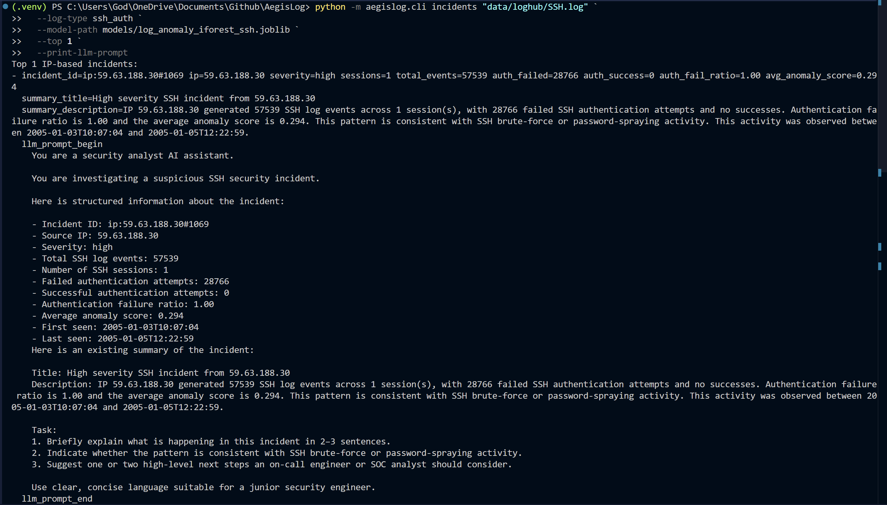

## 2026-03-22

### Rule-based incident recommendations

- Added a `recommend_incident_actions()` helper for SSH incidents that suggests simple, playbook-style next steps based on incident characteristics (e.g., high failed-auth counts with no successes). The helper recommends blocking or rate-limiting abusive IPs and reviewing targeted accounts, aligning with common SSH brute-force response guidance.
- Integrated recommended actions into `summarize_incident`, appending a concise “Recommended actions:” section to the incident description so summaries now include both what happened and what to do next.

### AI prompts enriched with actions

- Updated the LLM incident prompt builder in `aegislog.ai` to include a “Here are preliminary, rule-based recommended actions” block populated from `recommend_incident_actions()`, giving any future LLM a concrete starting set of remediation ideas to refine. This mirrors how many AI SOC tools pair structured data with canned guidance in their prompts.
- Verified that `--print-llm-prompt` output for SSH incidents now contains both the time window and recommended actions, making the prompts more informative and closer to real-world AI incident copilot designs.

### Local AI-style explanations and explain subcommand

- Implemented a `local_incident_explanation()` helper that generates a short, rule-based narrative for each SSH incident (severity, behavior, timing, and recommended actions), mimicking an AI-generated explanation without calling any external model.
- Extended the `incidents` CLI command with a `--show-local-explanation` flag that prints the local explanation between `local_explanation_begin` and `local_explanation_end`, next to the structured incident fields and summary.
- Introduced a new `explain` subcommand that focuses on a single SSH incident selected by index, printing its core fields, summary, local AI-style explanation, and an LLM-ready prompt bundle in one place. This subcommand acts as a small “incident copilot” interface on top of the existing detection pipeline.

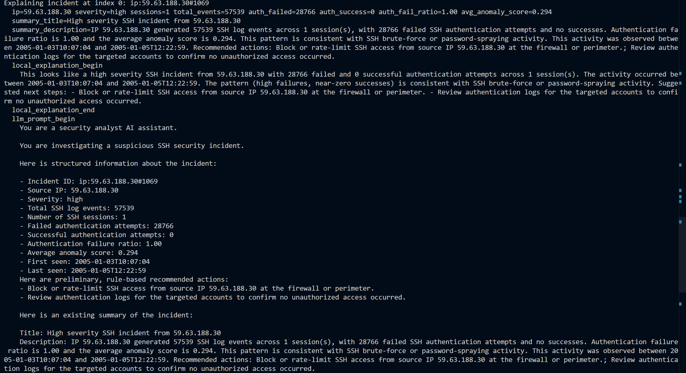

## 2026-03-23

### AI helpers and incident modeling cleanup

- Refined the `Incident` model and aggregation logic in `incidents.py` for clarity and consistency, tightening types, formatting, and severity heuristics while preserving behavior (including auth stats, time window, and recommended actions). This makes the incident representation cleaner and easier to extend.
- Polished `summarize_incident()` and `recommend_incident_actions()` so that brute-force hints, time window, and recommended actions are composed into a single well-formed paragraph, improving readability for both humans and downstream AI consumers.

### AI prompt and local explanation improvements

- Cleaned up `aegislog.ai` by simplifying `local_incident_explanation()` into a concise 2–4 sentence narrative that describes severity, behavior, timing, and next steps, making the local, rule-based “AI-style” explanation more readable and closer to real LLM output.
- Simplified `build_incident_llm_prompt()` to reuse `recommend_incident_actions()` when building the “preliminary, rule-based recommended actions” block and tightened string assembly, resulting in a clearer, easier-to-maintain incident prompt template.

### CLI explain/incidents command cleanup and JSON output

- Refactored the `incidents` and `explain` commands in `cli.py` to remove duplicate LLM prompt printing, ensure the incident `time_window` is displayed, and consistently use the shared helpers for summaries, local explanations, and prompts. This keeps the CLI behavior predictable and AI-ready.
- Added a `--format json` option to the `explain` command that emits a single structured JSON object containing the incident fields, summary, local explanation, and LLM prompt. This enables easy integration with other tools, scripts, or notebooks that want to consume AI-ready incident context programmatically.

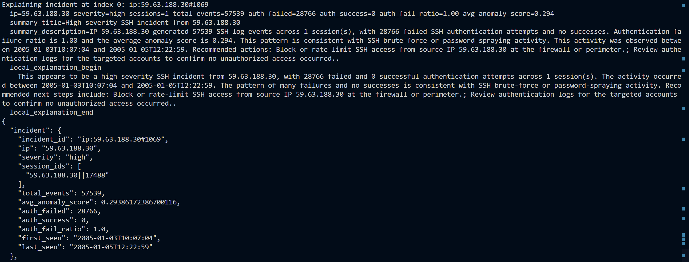

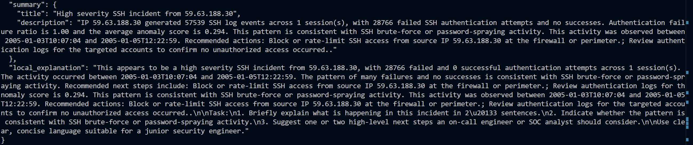


## 2026-03-29

**Focus:** AegisLog CLI UX, JSON output, and documentation.

### Completed
- Reviewed and understood existing `aegislog.cli` subcommands (`init`, `train`, `analyze`, `incidents`, `explain`), including `--log-type` and `--model-path` usage.
- Extended the `incidents` subcommand to support `--format json`, returning:
  - `incident` metadata (IP, severity, timestamps, auth stats, anomaly score).
  - `summary` (title + description).
  - `local_explanation` (rule-based AI-style explanation).
  - `llm_prompt` (ready-to-send LLM prompt).
- Verified `incidents --format json` against `data/loghub/SSH.log` with:
  - `--log-type ssh_auth`
  - `--model-path models/log_anomaly_iforest_ssh.joblib`
  - `--top 3`
- Confirmed that `explain` already supports `--format json` and validated example output.
- Created `cli_usage_cheatsheet.md` draft documenting:
  - All 5 subcommands.
  - Key arguments (`--log-type`, `--model-path`, `--top`, `--format`, `--use-llm`, etc.).
  - Copy-pasteable example commands for each subcommand.

### Notes / Learnings
- `analyze` supports both `apache_error` and `ssh_auth` log types using the general model `models/log_anomaly_iforest.joblib`.
- `incidents` and `explain` are currently SSH-only (`ssh_auth`) and use the SSH-specific model `models/log_anomaly_iforest_ssh.joblib`.
- JSON output for both `incidents` and `explain` is now suitable for downstream automation and LLM-based workflows.

### Next Ideas
- Add PowerShell-specific examples (with backticks) alongside the bash examples in the CLI cheatsheet.
- Implement and wire up the `init` subcommand to actually set up a SQLite experiment database.
- Add basic unit/integration tests for `incidents --format json` and `explain --format json` to guard against regressions.

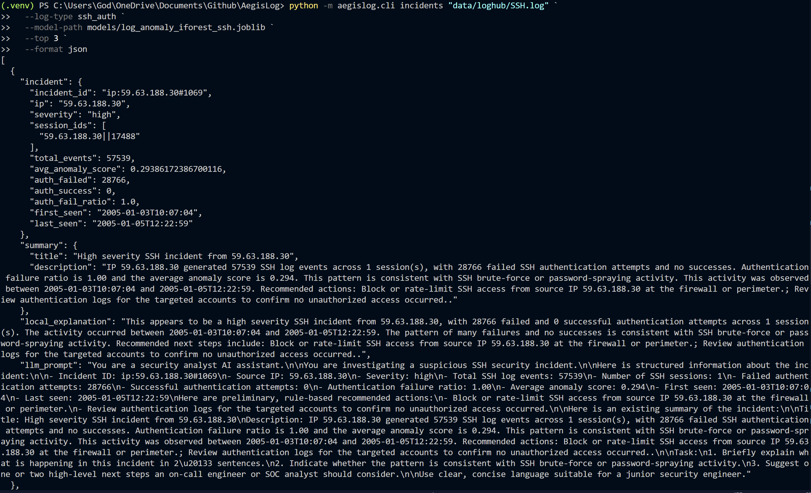


## 2026-04-01

**Focus:** AegisLog CLI improvements, structured output consistency, and maintainability.

### Completed
- Added JSON output support to the `analyze` command with `--format json`.
- Added optional file output support to `analyze` via `--output`, allowing JSON results to be written directly to disk.
- Fixed JSON serialization for `analyze` so missing values like `NaN` are normalized to proper JSON `null`.
- Added optional file output support to `incidents --format json` via `--output`.
- Added optional file output support to `explain --format json` via `--output`.
- Improved top-level CLI help output with a clearer description and example commands.
- Refactored repeated JSON serialization and output-writing logic into reusable helpers in `cli.py`.

### Verified
- Confirmed `analyze --format json --output analyze.json` works with SSH logs and produces structured session output.
- Confirmed `incidents --format json --output incidents.json` writes complete incident bundles, including summaries, local explanations, and LLM prompts.
- Confirmed `explain --format json --output explain.json` writes a single-incident explanation bundle correctly.
- Confirmed `python -m aegislog.cli -h`, `analyze -h`, `incidents -h`, and `explain -h` display the updated help text as expected.

### Notes
- `analyze` initially failed with `--format json` because the parser option had not yet been added to `p_analyze`; this was fixed by wiring the flag into argparse.
- A `payload is not defined` error occurred when JSON writing logic was placed in `main()` instead of inside the command handler; this was fixed by moving output handling into the appropriate command functions.
- SSH analysis output showed `user: null`, which is now valid JSON and preferable to raw `NaN`.

### Commits made
- Added output file support to `analyze` JSON output.
- Normalized NaN fields to null in `analyze` JSON output.
- Added output file support to `incidents` JSON output.
- Added output file support to `explain` JSON output.
- Improved CLI help text and examples.
- Refactored CLI JSON serialization helpers.

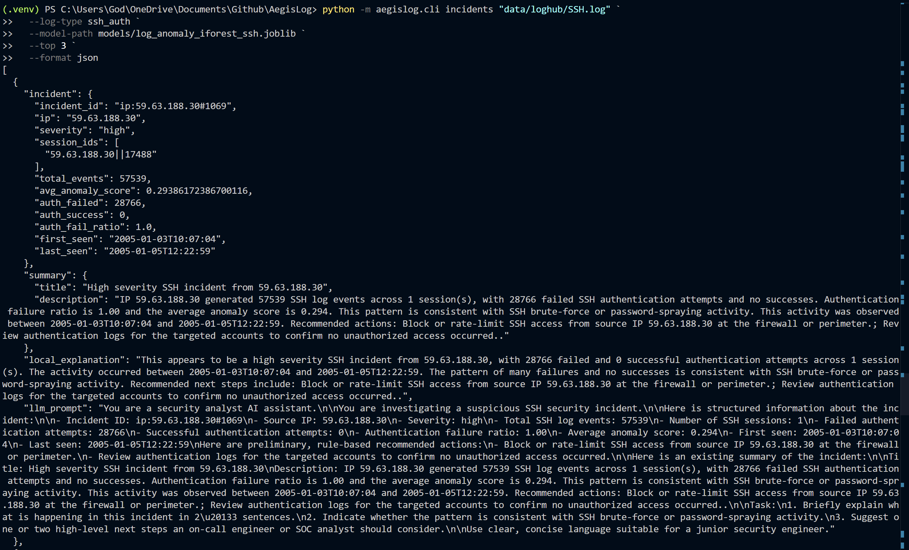

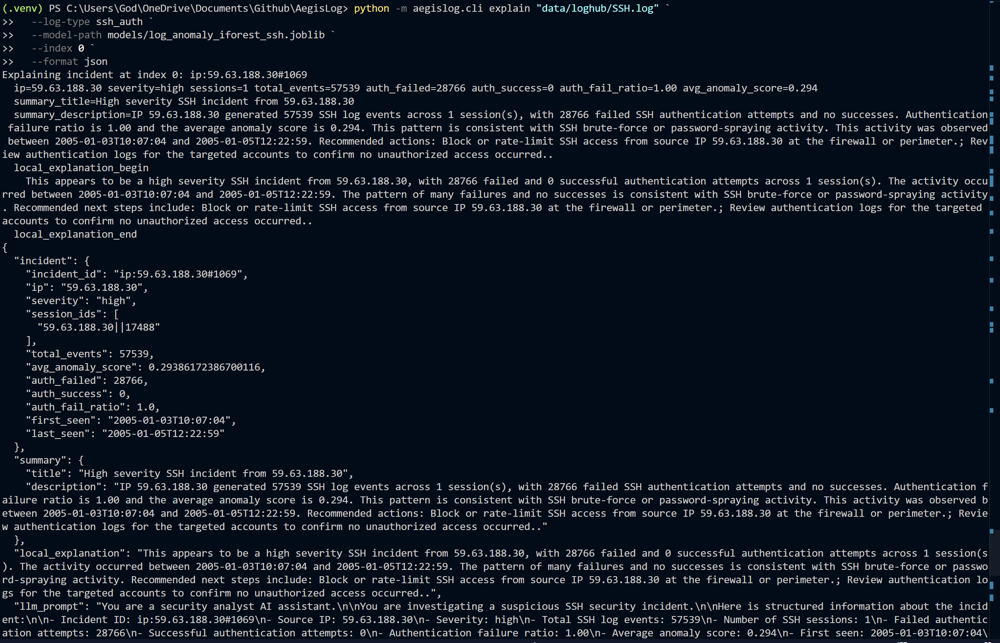

### Next ideas
- Add tests for CLI JSON helper functions and output-writing behavior.
- Add integration-style tests for `analyze`, `incidents`, and `explain` JSON modes.
- Consider adding `--output` support to future structured-output commands by default for consistency.

### Progress log: 04/05/2026

## Session structure and building
- Extended `Session` to include `start_time`, `end_time`, and `source_set` so each session has explicit time bounds and source metadata.  
- Updated `build_sessions()` to:
  - Use a stable, timestamp-based `session_id` format.
  - Populate `start_time`, `end_time`, and `source_set` when flushing sessions.

## Behavioral features and model inputs
- Updated `sessions_to_features()` to:
  - Use `s.start_time`/`s.end_time` instead of recomputing from events.
  - Fix variable name bugs in `avg_events_per_second` and `unique_paths`.
  - Add new features:
    - `avg_events_per_second`
    - `unique_paths`
    - `source_count`
    - `has_mixed_sources`
- Updated `NUMERIC_FEATURES` in `pipeline.py` to include:
  - `avg_events_per_second`
  - `unique_paths`
  - `source_count`
  - `has_mixed_sources`
- Note: retraining the IsolationForest model is now required to align with the new feature schema.

## Incident grouping and severity
- Renamed and refactored incident grouping from IP-only to principal-aware:
  - New function `group_sessions_to_incidents(...)` groups by `(ip, user)` when possible, falling back to IP only.
  - Added a `merge_window_minutes` parameter (default 60) and implemented time-window clustering so nearby sessions from the same principal form a single incident.
- Enhanced `Incident` dataclass:
  - Added `has_success_after_failures: bool`.
- Incident logic improvements:
  - Compute `has_success_after_failures` at cluster level (`auth_failed > 0 and auth_success > 0`).
  - Extended `_compute_severity(...)` to accept `has_success_after_failures` and treat “failed then successful logins” as a strong high-severity signal under reasonable anomaly/volume thresholds.
  - Updated severity call sites to pass this flag.
- Summary and actions:
  - Added compromise hint text in `summarize_incident(...)` when `has_success_after_failures` is true.
  - Existing recommended actions still apply, with better context from the new flags and severity logic.

## Commit messages used / suggested
- `Add avg_events_per_second and unique_paths features to session behavioral vectors`
- `Update anomaly detection pipeline to include new behavioral features`
- `Enhance Session model with start/end timestamps and source metadata`
- `Group incidents by IP and user context instead of IP alone`
- `Add time-window incident merging for related sessions`
- `Flag incidents with successful logins after failed auth attempts`


### Progress log: 04/06/2026

Model and pipeline structure
Added model versioning to the IsolationForest pipeline via MODEL_VERSION, MODEL_FILENAME, and MODEL_PATH constants, and updated load_model / score_sessions to use the versioned path by default.

Extended aegislog/ml/pipeline.py with two additional anomaly detection pipelines using the same feature set:

build_ocsvm_pipeline(...) using One-Class SVM (RBF kernel) for novelty detection.

build_lof_pipeline(...) using Local Outlier Factor in novelty=True mode for density-based anomalies.

Ensured all pipelines share the same NUMERIC_FEATURES and preprocessing (ColumnTransformer + StandardScaler), so models are directly comparable on identical session features.

Training script enhancements
Updated aegislog/ml/train.py to:

Import and use MODEL_PATH and NUMERIC_FEATURES from the pipeline module.

Add a --model-type flag with choices iforest, ocsvm, and lof to select which anomaly model to train.

Select the appropriate builder (build_pipeline, build_ocsvm_pipeline, build_lof_pipeline) based on --model-type.

Fit models explicitly on df[NUMERIC_FEATURES] instead of the whole DataFrame, aligning training with the pipeline’s expected feature schema.

Verified training paths:

Retrained the IsolationForest SSH model with:

python -m aegislog.ml.train --logs-path data/loghub/SSH.log --log-type ssh_auth --model-type iforest --model-path models/log_anomaly_iforest_ssh.joblib

Trained One-Class SVM and LOF variants on the same SSH data using:

--model-type ocsvm → models/log_anomaly_ocsvm_ssh.joblib

--model-type lof → models/log_anomaly_lof_ssh.joblib

Incident logic fixes and compatibility
Fixed Incident construction after adding has_success_after_failures and user:

Ensured group_sessions_to_incidents(...) passes has_success_after_failures and user into the Incident dataclass, resolving constructor errors during pytest.

Restored CLI compatibility for incident IDs:

Adjusted incident_id format back to an ip: prefix (e.g. ip:59.63.188.30#0 or ip:59.63.188.30|alice#0) so existing tests expecting incident_id.startswith("ip:") continue to pass, while still embedding user context in the suffix. 

Testing and tooling
Ran pytest, iterated on:

Fixing Incident.__init__ missing argument errors.

Fixing incident ID format to satisfy integration tests.

Confirmed training scripts and module invocation patterns:

Use python -m aegislog.ml.train ... from the repo root with actual log paths under data/loghub/.

# Progress – 2026-04-07

## Today’s Changes

### `pipeline.py`

- Added `add_threshold_columns` helper to compute `anomaly_percentile` and `is_anomalous` from session scores, designed to work with both single-model and ensemble scores.

### `cli.py` – `analyze` command

- Imported `add_threshold_columns` alongside `score_sessions` and `score_sessions_multi`.
- Added CLI flags:
  - `--threshold-percentile` to control the anomaly percentile cutoff.
  - `--alerts-only` to show only sessions at or above the threshold.
- Chose `sort_col` as `ensemble_score` when present, otherwise `anomaly_score`.
- Applied thresholding via `add_threshold_columns` before sorting.
- Filtered the dataframe when `--alerts-only` is set to keep only `is_anomalous == True`.
- Extended JSON output (`session_row_to_dict`) to include:
  - `anomaly_percentile`
  - `is_anomalous`
- Extended text output to display:
  - `anomaly_percentile`
  - `is_anomalous` for each session.

### `cli.py` – `incidents` command

- Added CLI flags:
  - `--threshold-percentile` to control the percentile cutoff before grouping.
  - `--alerts-only` to group incidents only from threshold-flagged anomalous sessions.
- Reused `add_threshold_columns` on the scored sessions dataframe.
- When `--alerts-only` is set, filtered the scored dataframe to `is_anomalous == True`.
- Restricted the `sessions` list to only those session IDs that remain after filtering, so incident grouping aligns with alerting.

### `incidents.py` – Severity and Explainability

- Kept `_compute_severity` as the core rules-based severity calculator.
- Added `_severity_reason` helper to provide a human-readable explanation of why an incident is `high` / `medium` / `low`:
  - Examples: “failures followed by successful SSH login(s)”, “very high failed-auth volume with high anomaly score”, “sustained failed-auth pattern with elevated anomaly score”.
- Extended `Incident` dataclass with:
  - `severity_reason: str`
- In `group_sessions_to_incidents`:
  - Computed `severity` using `_compute_severity`.
  - Computed `severity_reason` using `_severity_reason`.
  - Included `severity_reason` when constructing each `Incident`.
- Updated incident ordering:
  - Defined `severity_rank = {"high": 3, "medium": 2, "low": 1}`.
  - Sorted incidents by `(severity_rank[severity], avg_anomaly_score)` descending to surface the most urgent incidents first.
- Fixed a minor bug in `summarize_incident`:
  - Ensured `brute_force_hint` is initialized before use.

### Git Commits (conceptual)

- `Add percentile thresholding and alert filtering to analyze command`
- `Apply threshold filtering to incident generation in CLI`
- `Expose incident severity reasons and sort by severity in incidents`

## Planned for Next Session

- Surface `severity_reason` in:
  - `incident_to_dict` JSON output.
  - Text output of `cmd_incidents` (e.g., an extra line per incident).
- Add a concise `train.py` cheatsheet:
  - Required inputs and expected outputs.
  - Recommended model paths and log types.
  - Example commands for common workflows.


# Progress – 2026-04-08

## Today’s Changes

### Incident confidence & targeting (`incidents.py`)

- Extended `Incident` dataclass with:
  - `severity_reason`
  - `confidence`
  - `confidence_reason`
  - `primary_user`
  - `targeted_users`
- Added `_compute_confidence(...)` and `_confidence_reason(...)` helpers to assign:
  - `confidence` as `high` / `medium` / `low` based on:
    - anomaly score
    - failed/successful auth volume
    - failure ratio
    - session count
    - presence of success after failures
  - `confidence_reason` as a short human-readable explanation of the evidence strength.
- Updated `group_sessions_to_incidents(...)` to:
  - Calculate `severity`, `severity_reason`, `confidence`, and `confidence_reason` per incident cluster.
  - Derive targeted account information:
    - `users` gathered from clustered sessions
    - `targeted_users` as a de-duplicated list of usernames
    - `primary_user` as the first (or most common) targeted username.
- Kept existing severity-based sorting, now with richer per-incident context.

### Incident timelines & CLI wiring (`cli.py` + `incidents.py`)

- Added `IncidentTimelineEntry` dataclass and `build_incident_timeline(...)`:
  - Builds a per-incident session timeline with:
    - timestamp, session_id, ip, user
    - `auth_failed`, `auth_success`, `event_count`, `anomaly_score`
    - `event_type` (`failure`, `success`, `failures_then_success`, `session`)
  - Sorts entries chronologically by session start time.
- Wired incident timelines into the CLI:
  - New `--show-timeline` flag on `aegislog incidents`.
  - When enabled, prints a `timeline_begin`/`timeline_end` block per incident with one line per session entry.

### CLI incident confidence & severity (`cli.py`)

- Updated JSON output (`incident_to_dict`) to include:
  - `severity`
  - `severity_reason`
  - `confidence`
  - `confidence_reason`
- Updated `cmd_incidents` text output to print per incident:
  - `severity`
  - `severity_reason` (if present)
  - `confidence`
  - `confidence_reason`
- Updated `cmd_explain`:
  - Includes `confidence` in the header line.
  - Prints `severity_reason` and `confidence_reason` when available.

### Targeted account summaries (`cli.py` + `incidents.py`)

- `incidents.py`:
  - Derived `primary_user` and `targeted_users` for each incident from clustered session usernames.
- `cli.py` (conceptual plan / next small tweak):
  - JSON and text output are now ready to surface targeted account information alongside IP, severity, confidence, and timelines.

## Commits (conceptual)

- `Add confidence scoring and reasons to incidents`
- `Add per-incident session timeline output to CLI`
- `Surface incident confidence and targeted users in CLI output`


# AegisLog – Progress Log

## Date

2026-04-09

## High-level summary

- Improved the `aegislog.cli` UX around anomaly thresholding and incident triage.
- Added severity/confidence-based filtering for incidents and reports.
- Updated documentation (`cli_usage_cheatsheet.md`) to match the current CLI surface.

---

## Changes made

### `cli.py`

- Added ordering maps and a shared incident filter:
  - `SEVERITY_ORDER = {"low": 1, "medium": 2, "high": 3}`
  - `CONFIDENCE_ORDER = {"low": 1, "medium": 2, "high": 3}`
  - New helper `filter_incidents_by_thresholds(incidents, min_severity, min_confidence)`:
    - Filters incidents by minimum severity and confidence.
    - Treats missing confidence as below any requested `min_confidence`.

- `cmd_analyze`:
  - Integrated `add_threshold_columns()` to compute:
    - `anomaly_percentile`
    - `is_anomalous`
  - Added CLI flags:
    - `--threshold-percentile` (float, default `99.0`): percentile cut-off for marking sessions anomalous.
    - `--alerts-only`: filter output down to `is_anomalous=True`.
  - Ensured JSON output includes scores plus `anomaly_percentile` and `is_anomalous`.

- `cmd_incidents`:
  - Uses the same thresholding pipeline as `analyze` via `add_threshold_columns()` with a percentile-based cut-off.
  - Filters the `sessions` list to those present in the scored DataFrame (keeps grouping aligned with thresholded sessions).
  - Added CLI flags:
    - `--threshold-percentile`: percentile used before incident grouping.
    - `--alerts-only`: group incidents only from threshold-flagged anomalous sessions.
    - `--min-severity`: `low|medium|high` – filter incidents at or above this severity.
    - `--min-confidence`: `low|medium|high` – filter incidents at or above this confidence.
    - `--show-timeline`: print a per-incident session timeline ordered by time.
  - Text output now includes:
    - `severity`, `severity_reason`
    - `confidence`, `confidence_reason`
    - `primary_user`, `targeted_users`
    - Optional timeline
    - Summary title and description per incident.
  - JSON path now returns a bundle:
    - `incident` (fields including `primary_user`, `targeted_users`)
    - `summary` (title, description)
    - `local_explanation`
    - `llm_prompt` (prompt text)

- `cmd_report`:
  - Uses `add_threshold_columns()` to label anomalous sessions.
  - Restricts incident grouping to anomalous sessions only.
  - Applies `filter_incidents_by_thresholds()` so reports can be scoped by:
    - `--min-severity`
    - `--min-confidence`
  - Text output prints:
    - `total_sessions`
    - `anomalous_sessions`
    - `anomalous_session_percent`
    - `total_incidents`
    - `severity_counts`
    - `confidence_counts`
    - `top_incident_ips`
    - `top_targeted_users`
  - JSON output returns the same information as a structured dict.

- `cmd_explain`:
  - Uses grouped incidents and prints a richer header:
    - `severity`, `confidence`, `severity_reason`, `confidence_reason`
    - session counts, event totals, failure ratios, anomaly scores
  - JSON output reuses `incident_to_dict()` for consistency across `explain` and `incidents`.

- Parser updates:
  - `analyze`:
    - Added `--threshold-percentile`, `--alerts-only`.
    - Kept `--multi-score`, `--profile`, and `--model-type`.
  - `incidents`:
    - Added `--threshold-percentile`, `--alerts-only`, `--min-severity`, `--min-confidence`, `--show-timeline`.
    - Moved `set_defaults(func=cmd_incidents)` to the end of the parser block for readability.
  - `report`:
    - Added `--multi-score`, `--threshold-percentile`, `--min-severity`, `--min-confidence`.
    - `set_defaults(func=cmd_report)` at the end of its argument block.

---

### `cli_usage_cheatsheet.md`

- Added a **Quick start** section with three common commands:

  - Analyze noisy sessions:

    ```bash
    python -m aegislog.cli analyze data/loghub/SSH.log --log-type ssh_auth --top 10
    ```

  - See worst SSH incidents (medium+ severity):

    ```bash
    python -m aegislog.cli incidents data/loghub/SSH.log --log-type ssh_auth --min-severity medium --top 5
    ```

  - Get an incident metrics report:

    ```bash
    python -m aegislog.cli report data/loghub/SSH.log --log-type ssh_auth
    ```

- Documented new flags:
  - `analyze`:
    - `--threshold-percentile`
    - `--alerts-only`
    - `--multi-score`
    - `--profile`
  - `incidents`:
    - `--threshold-percentile`
    - `--alerts-only`
    - `--min-severity`
    - `--min-confidence`
    - `--show-timeline`
  - `report`:
    - `--multi-score`
    - `--threshold-percentile`
    - `--min-severity`
    - `--min-confidence`
- Clarified JSON payloads:
  - Incidents: incident + summary + local explanation + LLM prompt.
  - Report: sessions, anomalous stats, incident counts, distributions, top IPs/users.

---

## Behavior verified

- `python -m aegislog.cli analyze data/loghub/SSH.log --log-type ssh_auth --top 10`
  - Shows top sessions with `anomaly_percentile` and `is_anomalous`.

- `python -m aegislog.cli analyze ... --alerts-only`
  - Filters to `is_anomalous=True` only.

- `python -m aegislog.cli incidents data/loghub/SSH.log --log-type ssh_auth --min-severity high`
  - Returns only `severity=high` incidents (large brute-force patterns, medium confidence).

- `python -m aegislog.cli incidents ... --min-confidence high`
  - Returns low-severity but high-confidence incidents (failed-then-successful logins, likely compromise patterns).

- `python -m aegislog.cli report data/loghub/SSH.log --log-type ssh_auth --min-confidence high`
  - Correctly prints “No incidents matched…” given all incidents currently have `confidence=medium`.

- `python -m aegislog.cli report data/loghub/SSH.log --log-type ssh_auth --min-severity medium --min-confidence medium --format json`
  - Returns JSON summary for 109 incidents (medium + high severity, all medium confidence), including:
    - `total_sessions`, `anomalous_sessions`, `anomalous_session_percent`
    - `total_incidents`
    - `severity_counts`, `confidence_counts`
    - `top_incident_ips`, `top_targeted_users`

---

## Notes / rationale

- Percentile-based thresholding (`--threshold-percentile`) is now the unified mechanism for deciding which sessions are anomalous across `analyze` and `incidents`, reducing configuration drift.
- Severity and confidence are treated as ordered categorical fields and filtered via a single helper (`filter_incidents_by_thresholds()`), ensuring `incidents` and `report` apply filters consistently.
- Missing or unknown `confidence` is treated as below any requested `--min-confidence` to avoid showing low-information incidents when the user explicitly requests higher-confidence ones.


## 2026-04-11 – AegisLog structural improvements

- CLI
  - `explain`: now accepts `--min-severity`, `--min-confidence`, and `--first`, selecting incidents after filtering instead of global index.
  - `incidents`: added `--sort-by` (`severity`, `avg_score`, `auth_fail_ratio`, `total_events`) and show the chosen sort key in the header.
- Incident model
  - Group incidents by source IP (with time-window clustering) instead of `(ip, user)` pairs; derive `primary_user` and `targeted_users` per cluster.
  - Added derived fields: `priority`, `priority_score`, `priority_reason` combining severity and confidence.
  - Added SSH-specific `attack_pattern` and `attack_pattern_reason` (e.g., `password_spray`, `brute_force`, `possible_compromise`, `low_signal`).
- Outputs
  - Surfaced new fields in JSON and text outputs for `incidents`, `explain`, and `report` (`priority_counts`, `attack_pattern_counts`).
  - Updated CLI cheatsheet to reflect new flags and JSON payload fields.

# AegisLog – Progress Log (04/13/2026)

## CLI: Attack pattern filtering

- Added a `--pattern` option (multi-value via `action="append"`) to:
  - `incidents` (filter incidents by `attack_pattern`).
  - `explain` (limit candidate incidents before selection).
  - `report` (scope reports to specific `attack_pattern` types).
- Implemented `filter_incidents_by_patterns(incidents, patterns)` in the CLI and wired it into:
  - `cmd_incidents` after severity/confidence filtering.
  - `cmd_explain` after severity/confidence filtering.
  - `cmd_report` after severity/confidence filtering.
- Updated “no incidents” messages to mention pattern filters where appropriate.

## CLI: Incident loading refactor

- Introduced a shared helper in `cli.py`:

  ```python
  load_ssh_incidents_for_cli(
      args,
      *,
      anomalous_only: bool = False,
      restrict_sessions_to_df: bool = True,
  )
  ```

  This helper:
  - Parses SSH logs and builds sessions.
  - Scores sessions with the chosen model.
  - Applies anomaly thresholding using `threshold_percentile` (with a safe default when missing).
  - Optionally filters to anomalous sessions only (`anomalous_only`).
  - Optionally restricts the `Session` list to IDs present in the post-filter DataFrame.
  - Groups sessions into incidents via `group_sessions_to_incidents`.

- Refactored `cmd_incidents` to use the helper:

  ```python
  sessions, df, incidents = load_ssh_incidents_for_cli(
      args,
      anomalous_only=getattr(args, "alerts_only", False),
      restrict_sessions_to_df=True,
  )
  ```

  - This now cleanly wires `--alerts-only` into the grouping path.

- Refactored `cmd_explain` to use the same helper:

  ```python
  sessions, df, incidents = load_ssh_incidents_for_cli(args)
  ```

  - Behavior:
    - Uses the shared thresholding logic.
    - Keeps all sessions represented in the post-threshold DataFrame.
    - Then applies `--min-severity`, `--min-confidence`, and `--pattern` as before.
  - Fixed a bug where `explain` lacked `threshold_percentile` by switching to:

    ```python
    threshold_percentile=getattr(args, "threshold_percentile", 99.0)
    ```

    inside the helper.

## Tests: Integration and JSON shape

- Extended `tests/test_cli_incidents_integration.py`:
  - Kept `test_incidents_ssh_json_output` to assert base JSON shape.
  - Added `test_incidents_ssh_json_output_filtered_by_pattern`:
    - Runs `incidents` in JSON mode with `--pattern password_spray`.
    - If any incidents are returned, asserts:
      - `attack_pattern == "password_spray"`.
      - `priority` is one of `{"low", "medium", "high", "critical"}`.
      - `priority_score` is an `int` and `priority_reason` is a non-empty string.

- Extended `tests/test_cli_explain_integration.py`:
  - Kept `test_explain_ssh_json_output` to assert base JSON shape.
  - Added `test_explain_ssh_json_output_filtered_by_pattern`:
    - Runs `explain` in JSON mode with `--first` and `--pattern password_spray`.
    - Asserts presence of core fields and that:
      - `attack_pattern == "password_spray"`.
      - `priority` is one of `{"low", "medium", "high", "critical"}`.
      - `priority_score` is an `int` and `priority_reason` is a non-empty string.

## Tests: Helper behavior

- Strengthened `_compute_priority` tests in `test_incidents.py`:
  - Now assert exact `(priority, score)` for key combinations like:
    - `("high", "high") -> ("critical", 68)`.
    - `("medium", "medium") -> ("medium", 30)`.
    - `("low", "low") -> ("low", 8)`.

## Commits (summary-level)

- Add attack pattern filters to `incidents`, `explain`, and `report` CLI commands.
- Expand integration tests to verify `attack_pattern` and priority fields in JSON.
- Refactor SSH incident commands to use a shared `load_ssh_incidents_for_cli` helper and wire `--alerts-only` through it.


# AegisLog – Progress Log (2026‑04‑21)

## CLI internals and refactors

- **Shared SSH incident loader**
  - Confirmed `cmd_incidents`, `cmd_explain`, and `cmd_report` all use the shared `load_ssh_incidents_for_cli()` helper.
  - Report now reuses the same scoring, thresholding, anomalous filtering, and grouping behavior as incidents/explain instead of duplicating logic.

- **Explain command threshold support**
  - Exposed `--threshold-percentile` on the `explain` subcommand, keeping it consistent with `analyze`, `incidents`, and `report`.
  - Kept the helper’s `getattr(args, "threshold_percentile", 99.0)` behavior, so explain now cleanly accepts a custom percentile while defaulting to 99.0.

## Tests and integration coverage

- **Report JSON integration tests**
  - Added `tests/test_cli_report_integration.py` with:
    - A base JSON shape test for `report` on SSH logs.
    - A `--pattern password_spray` test asserting that `attack_pattern_counts` and `total_incidents` are scoped to the selected pattern when any incidents exist.
    - A combined `--min-severity`, `--min-confidence`, and `--pattern` test to ensure counts only appear in allowed severity/confidence buckets and match the requested pattern.

- **Explain JSON integration tests**
  - Extended `tests/test_cli_explain_integration.py` to cover:
    - JSON output structure for `explain` on SSH logs.
    - A run using a custom `--threshold-percentile` to ensure the flag is accepted and that JSON output is produced correctly.

- **Test status**
  - All existing and new CLI integration tests pass:
    - analyze / incidents / explain / report JSON flows.
    - Filtering by severity, confidence, and attack pattern.
    - Custom threshold-percentile handling across commands.

## Design work for Apache incidents

- **Apache incident concept (design only, no code yet)**
  - Decided that Apache incidents will also be **IP-based groupings** of anomalous sessions, analogous to SSH, but driven by web-specific behavior.
  - Sketched initial Apache `attack_pattern` categories:
    - `scanner_activity` – broad probing from a source IP hitting many distinct paths.
    - `missing_resource_burst` – bursts dominated by missing-resource/404-style activity.
    - `exploit_probe` – suspicious or exploit-looking paths/payloads (e.g., admin panels, config/env files, web-shell targets).
    - `server_error_trigger` – repeated activity correlated with 5xx/server-side failures.
    - `low_signal_web_noise` – anomalous but ambiguous web activity with weak evidence.
  - Outlined that Apache severity/confidence will reuse the same top-level fields as SSH but be driven by:
    - volume and concentration of activity per IP,
    - presence of suspicious paths/payloads,
    - status-code patterns (404/5xx bursts),
    - repetition and focus of the behavior.

## “Tomorrow’s plan” (next steps)

- Add Apache-specific constants and stubs:
  - Introduce `APACHE_ATTACK_PATTERNS` and a `classify_apache_attack_pattern(...)` stub that currently returns `low_signal_web_noise`.
  - Document intended heuristics in a module comment/docstring so the design is captured in code.
- Later, wire Apache incidents into:
  - `aegislog.incidents` (grouping + pattern classification).
  - CLI commands (conditional support for `--log-type apache_error` in `incidents` and `report` once behavior is implemented).  


Progress log: 04/25/2026


## CLI behavior and options

- Aligned **alerts-only behavior** across commands:  
  - `incidents`, `report`, and `explain` now all accept `--alerts-only`, which controls whether incidents are built only from threshold-flagged anomalous sessions.  
  - `analyze` already used `--alerts-only` to filter sessions; now the semantics are consistent across SSH incident commands.

- Strengthened **JSON output contract** for `report`:  
  - When `--format json --output ...` is used and severity/confidence/pattern filters match no incidents, the CLI now writes a valid, empty incident report JSON instead of creating no file.  
  - Text mode still prints a clear message: “No incidents matched the specified severity/confidence/pattern filters.”  

- Ensured **backwards compatibility** for tests and public API:  
  - Re-exported `incident_to_dict` from the main CLI module so existing imports like `from aegislog.cli import incident_to_dict` continue to work.  
  - This avoided test breakage after the module split without changing behavior.

## Shared helpers and constants

- Introduced **shared choice constants** for severity and confidence:  
  - Added `SEVERITY_CHOICES` and `CONFIDENCE_CHOICES` to back argparse `choices` and keep them in sync with `SEVERITY_ORDER` and `CONFIDENCE_ORDER`.  
  - Removed duplicated `"low", "medium", "high"` literals from parser setup.

- Centralized **common helpers** in a new module:  
  - Created `cli_common` with:
    - `SEVERITY_CHOICES`, `CONFIDENCE_CHOICES`, `SEVERITY_ORDER`, `CONFIDENCE_ORDER`.  
    - `write_output` for consistent file/stdout handling.  
    - `session_row_to_dict` for JSON session rows.  
    - `resolve_model_path` and `resolve_multi_model_paths` for model selection.  
    - `add_json_output_args` to DRY up `--format` / `--output` parsing.

## SSH-specific split: `cli_ssh`

- Created **`cli_ssh` module** to hold SSH-incident logic:  
  - Constants and filters:
    - `SSH_ATTACK_PATTERN_CHOICES`.  
    - `filter_incidents_by_patterns`.  
    - `sort_incidents`.  
    - `filter_incidents_by_thresholds`.  
  - Serialization helpers:
    - `incident_to_dict`.  
    - `timeline_entry_to_dict`.  
  - Shared loader:
    - `load_ssh_incidents_for_cli(args, anomalous_only, restrict_sessions_to_df)` that:
      - Parses SSH auth logs.  
      - Builds sessions and scores them.  
      - Adds threshold columns.  
      - Optionally filters to anomalous sessions.  
      - Restricts sessions to those in the filtered DataFrame.  
      - Groups sessions into incidents.

- Moved **SSH-only parser helpers** into `cli_ssh`:  
  - `add_ssh_source_args` (log path, log-type `ssh_auth`, model path, model type).  
  - `add_incident_filter_args` (severity, confidence, pattern filters using the shared choice constants).

- Migrated **SSH commands** into `cli_ssh`:  
  - `cmd_incidents` now:
    - Uses `load_ssh_incidents_for_cli` with `anomalous_only` wired to `--alerts-only`.  
    - Applies severity, confidence, and pattern filters.  
    - Supports `--sort-by`, `--show_timeline`, `--show_local_explanation`, `--print_llm_prompt`.  
    - Respects `--format json` and `--output`.  
  - `cmd_explain` now:
    - Uses the shared loader with `anomalous_only` wired to `--alerts-only`.  
    - Applies the same filters and supports `--first` and `--index`.  
    - Outputs local explanation, and optionally calls the LLM or prints the LLM prompt.  
    - Supports `--format json` and `--output`.  
  - `cmd_report` now:
    - Uses `load_ssh_incidents_for_cli` with `anomalous_only` wired to `--alerts-only`.  
    - Computes totals and anomalous session counts.  
    - Applies severity, confidence, and pattern filters.  
    - In JSON mode always writes a report, even when filters match nothing.

## Slimmed-down `cli` entrypoint

- `cli.py` now focuses on:  
  - Top-level imports and shared wiring.  
  - Simple commands: `cmd_examples`, `cmd_init`, `cmd_train`.  
  - Cross-dataset `cmd_analyze` (Apache + SSH) using shared helpers from `cli_common`.  
  - Parser construction:
    - Uses `add_json_output_args` from `cli_common`.  
    - Uses `add_ssh_source_args` and `add_incident_filter_args` from `cli_ssh`.  
    - Wires subparsers to `cmd_incidents`, `cmd_explain`, `cmd_report`, and `cmd_analyze`.  

- Maintained **CLI surface compatibility**:  
  - Command names and most flags stayed the same.  
  - New/updated flags:
    - `--alerts-only` added to `report` and `explain`.  
    - Shared severity/confidence choices via constants.  

## Testing and outcomes

- After resolving the import and JSON output issues:  
  - Integration tests, including `test_cli_report_integration.py`, now pass.  
  - The CLI refactor is behaviorally compatible, but structurally cleaner and easier to extend (e.g., for future Apache incident support).


Progress log: 04/26/2026

Refactored cli.py so parser construction now lives in build_parser(), which separates CLI assembly from parse-and-dispatch flow and makes the entrypoint cleaner to test.

Extracted the analyze subparser registration into aegislog/cli_analyze.py, continuing the modular CLI structure already started for SSH subcommands.

Moved cmd_analyze into cli_analyze.py so the analyze command now owns both its parser wiring and command implementation in one module.

Kept cli.py as a thinner orchestration layer that mainly registers commands and dispatches execution.

Fixed the pytest collection/import regression by restoring write_output and session_row_to_dict as imports in aegislog.cli, preserving the public import surface expected by tests/test_cli_json.py.

Re-ran tests successfully after the compatibility fix, so the refactor is in a passing state.

Tomorrow todo
Extract train into a dedicated cli_train.py module with a register_train_parser(subparsers) helper and cmd_train, so cli.py continues shrinking consistently.

Consider doing the same for the remaining lightweight commands, especially examples and init, if you want a fully uniform module-per-command structure.

Decide whether cli.py should remain a compatibility surface for helper imports like write_output and session_row_to_dict, or whether tests should eventually import those directly from cli_common.

Add or update CLI-focused tests around build_parser() so parser existence, subcommand registration, and dispatch assumptions are covered explicitly.

If energy is lower tomorrow, make the first task just the cli_train.py extraction, since that is the cleanest next incremental refactor and keeps momentum without opening too many fronts.

Here’s a concise progress log for **Day 1 — Finish SSH**.

## Progress log 04/28/2026

## High-level outcome

- SSH detection is **feature-complete** for this phase: richer behavioral features, stronger incident scoring, clear attack patterns, and dedicated tests all in place.

## Code changes

- **Feature extraction (`behavioral.py`):**
  - Added SSH-focused behavioral features:
    - `auth_failed_streak_max` (longest failed-auth streak).
    - `success_after_failure_count` (count of successes occurring after failures).
    - `auth_burst_max_per_minute` (peak events per 60s window).
    - `mean_inter_event_gap_seconds`, `max_inter_event_gap_seconds`.
    - `ssh_distinct_users`, `ssh_distinct_ips_per_user`, `ssh_distinct_targeted_users`.
    - `ssh_rare_hour` (early-hours activity flag).
    - `first_seen_ip_flag`, `first_seen_user_flag` (within-batch first-seen).  
  - Ensured these are all returned in `sessions_to_features(...)`.

- **Model pipeline (`pipeline.py`):**
  - Extended `NUMERIC_FEATURES` to include all new SSH features so they are used by Isolation Forest / OCSVM / LOF.

- **Incident logic (`incidents.py`):**
  - Extended `Incident` with:
    - `auth_failed_streak_max`
    - `auth_burst_max_per_minute`
  - Aggregated these per incident cluster (max across sessions).
  - Updated severity and confidence:
    - High severity for extremely high failure volume + strong automation signals (long streaks / high bursts).
    - High confidence when there is strong evidence such as success-after-failures, long streaks, and/or high bursts.
  - Updated severity/confidence reasons to mention:
    - “extremely high failed-auth volume with intense automated behavior.”
    - “very long consecutive failed-auth streak indicating automated guessing.”
  - Kept and refined attack patterns:
    - `possible_compromise`, `password_spray`, `brute_force`, `low_signal`, `suspicious_auth_activity`.
  - Enriched summaries:
    - “Authentication intensity: maximum consecutive failed attempts reached …” plus recommended actions.

## Tests and verification

- Added unit tests:
  - High-severity/high-confidence brute-force incident test for the new thresholds and reasons.
  - `success_after_failure_count` behavior test.
- Ran:
  - `python -m pytest` (full suite, all tests passing).
  - Manual SSH runs:
    - `python -m aegislog.cli analyze ... --log-type ssh_auth`
    - `python -m aegislog.cli incidents ... --log-type ssh_auth`
  - Observed top SSH incidents now show:
    - `severity=high`, `confidence=high`, `priority=critical`.
    - Clear brute-force pattern and intensity wording.

## Commits (suggested messages you used/planned)

- `feat(ssh-features): add success-after-failure, inter-event gaps, and first-seen flags`
- `feat(ssh-incidents): finalize ssh incident severity and intensity-based scoring`
- `test(ssh-incidents): cover high severity and confidence for extreme brute-force`

## Status of Day 1 plan

- Add SSH-specific features → **Done** (including extra timing and first-seen flags).
- Improve SSH incident evidence → **Done** (richer summaries, patterns, and reasons).
- Add/update SSH unit tests → **Done**.
- Run `python -m pytest` → **Done**, full suite passing.


***


## Progress log – Saturday, May 2, 2026 (Apache focus)

1. **Apache error log parsing and features**
   - Verified `apache_error.py` correctly parses Apache error log lines into `LogEvent` objects with timestamps and levels (stored in `user_agent`).
   - Extended `sessions_to_features` in `behavioral.py` with Apache-focused features:
     - Error-level metrics: `apache_error_vs_notice_ratio`, `apache_error_burst_max_per_minute`, `apache_high_severity_events`, `apache_high_severity_ratio`.
     - Status/code metrics: `apache_5xx_streak_max`, `apache_404_burst_max_per_minute`, `apache_5xx_burst_max_per_minute`.
     - Template/path rarity: `apache_distinct_message_templates`, `apache_rare_error_message_count`, `apache_rare_error_message_ratio`, `apache_distinct_paths`, `apache_rare_path_ratio`.
     - Time-based: `apache_rare_hour`.
   - Ensured these new Apache features are wired into the model via `pipeline.py` (`NUMERIC_FEATURES` list).

2. **Apache behavioral tests**
   - Added `tests/test_behavioral_apache.py` to validate Apache feature behavior on a synthetic session:
     - Asserts correct 5xx counts and streaks.
     - Checks error vs notice ratios and error/5xx bursts.
     - Verifies distinct template count and rare-template metrics.
     - Confirms rare-hour flag behavior.
   - Fixed a constructor mismatch (`Session` requiring `user_agent`) so the test uses the real `Session` shape.

3. **Apache CLI for anomaly inspection**
   - Implemented `aegislog/cli_apache.py` as a log-based CLI:
     - Accepts an Apache error `.log` file as a positional `log_path`.
     - Uses `parse_error_file` → `build_sessions` → `score_sessions` (with `resolve_model_path`) to score Apache sessions end-to-end.
     - Sorts by anomaly score (`ensemble_score` or `anomaly_score`) and prints top N suspicious sessions.
     - For each session, prints session id, score, error ratio, 5xx burst, and a concise notes summary derived from the Apache features (e.g., “errors dominate over notices”, “many rare error templates”, “activity during unusual hours”).
   - Confirmed the CLI works on the real LogHub sample:
     - `python -m aegislog.cli_apache .\data\loghub\Apache.log -n 20`
     - Output shows top sessions with anomaly scores and human-readable notes.

4. **CLI tests**
   - Replaced the old CSV-based CLI test with an integration-style log-based smoke test in `tests/test_cli_apache.py`:
     - Calls `apache_main([ "data/loghub/Apache.log", "--top", "5" ])`.
     - Asserts exit code 0 and verifies the output includes the header and key fields (`score=`, `notes:`).
   - Marked the test as `@pytest.mark.integration` and confirmed it passes; only remaining minor follow-up is to register the custom marker in `pytest.ini` to silence the PytestUnknownMarkWarning.

5. **Overall status**
   - Apache is now complete for this phase:
     - Parsing from `.log` files.
     - Session and feature extraction with Apache-specific behavioral metrics.
     - Anomaly scoring via the shared ML pipeline.
     - A log-based CLI (`cli_apache`) that surfaces top suspicious Apache sessions with interpretable notes.
     - Behavioral and CLI tests passing, plus manual validation on the LogHub sample.


***

## Progress log – Sunday, May 3, 2026 (Day 3 – Improve ML)

1. **Baseline and deviation features for identities**
   - Extended `sessions_to_features` in `behavioral.py` to compute per-identity baselines:
     - Per-IP baseline: `ip_events_per_session` (average events per session for each IP in the dataset).
     - Per-user baseline: `user_events_per_session` (average events per session for each user).
   - Added deviation features:
     - `ip_events_per_session_deviation` = current session `event_count` − IP baseline.
     - `user_events_per_session_deviation` = current session `event_count` − user baseline.
   - Implemented “rare-seen” indicators driven by session counts:
     - `rare_seen_ip_flag` for identities with fewer than a small number of sessions.
     - `rare_seen_user_flag` using the same idea, but by user.
   - Kept existing first-seen signals and wired them into the same block:
     - `first_seen_ip_flag`
     - `first_seen_user_flag`

2. **Feature wiring into the ML pipeline**
   - Updated `NUMERIC_FEATURES` in the pipeline to include the new baseline/rare-seen fields so all three model types (IF / OCSVM / LOF) see the same richer feature set:
     - `rare_seen_ip_flag`, `rare_seen_user_flag`
     - `ip_events_per_session`, `ip_events_per_session_deviation`
     - `user_events_per_session`, `user_events_per_session_deviation`

3. **Behavioral tests for baseline features**
   - Introduced a dedicated `test_behavioral_baseline.py` to keep Day 3 logic clearly scoped.
   - Built synthetic SSH-style sessions for multiple identities:
     - Multiple sessions for a shared IP/user (`1.1.1.1` / `alice`) with event counts 2, 4, 8.
     - A separate identity (`2.2.2.2` / `bob`) with a single 3-event session.
   - Asserted:
     - Correct first-seen flags for the earliest session (`s1`) and zero for later ones.
     - Correct rare-seen behavior: “common” identity not rare, single-session identity marked rare.
     - Baseline averages: `(2 + 4 + 8) / 3` events per session for the shared IP/user.
     - Deviations equal `event_count - baseline` for each session.
     - Single-session identity has baseline equal to its own event count and zero deviation.
   - Left Apache-specific tests in `test_behavioral_apache.py` and helper logic in SSH-oriented tests, preserving a clean separation.

4. **Test structure and naming clean-up**
   - Clarified the test layout and responsibilities:
     - `test_behavioral_apache.py` for Apache-specific features.
     - `test_behavioral_baseline.py` for first-seen, rare-seen, and baseline deviation features.
     - The existing `test_behavioral.py` remains as the place for generic behavioral/SSH helpers for now, with a plan to eventually rename/split into `test_behavioral_ssh.py` once more SSH-specific tests are added.
   - Captured a mental model of a future test layout that groups tests by feature (SSH, Apache, baseline, CLI) while keeping the current files small and understandable.

5. **Commit planning**
   - Chose clear, focused commit messages for today’s changes:
     - For `behavioral.py`: `feat: add ip/user baseline deviation and rare-seen features`
     - For pipeline feature wiring: `chore: include baseline deviation features in numeric pipeline`

***

Net result: Day 3 is now grounded with concrete IP/user baseline features, properly wired into the pipeline and covered by tests. The next time you sit down, you’re ready to: (1) re-train models with the richer feature set, and (2) start building a small experiment harness to compare IF / OCSVM / LOF in a more systematic way.


Progress Log — 2026-05-05 (Day 4: Incident Evidence Layer)
Added IncidentEvidence and SessionEvidence dataclasses (aegislog/incident/evidence.py) to represent AI-ready incident context, including per-session evidence and a structured extra field for derived signals.

Implemented build_ssh_incident_evidence(...) in aegislog/incidents.py to turn an Incident plus its timeline into an IncidentEvidence object with SSH-specific highlights (e.g., success-after-failures, high failure volume, max streak, burstiness) and JSON-safe session evidence.

Implemented build_apache_incident_evidence(...) in aegislog/incidents.py to construct IncidentEvidence for Apache error sessions using 5xx counts, rare error templates, rare paths, bursts, and rarity-of-hour metrics.

Refactored SSH explain flow in cli_ssh.py to build IncidentEvidence for the selected incident and include it in --format json output as a new incident_evidence object, while preserving the existing top-level incident, summary, local_explanation, and llm_prompt keys expected by integration tests and existing consumers.

Added focused tests for the evidence builders:

tests/test_incident_evidence_ssh.py verifies that build_ssh_incident_evidence produces correct IDs, highlights, extra fields, and fully JSON-serializable payloads.

tests/test_incident_evidence_apache.py does the same for build_apache_incident_evidence.

Updated tests/test_cli_explain_integration.py to continue asserting the legacy JSON contract while now being satisfied by the refactored explain flow that adds incident_evidence for debugging and downstream tooling.

Ran python -m pytest and confirmed that the entire test suite, including the new incident evidence and explain JSON integration tests, passes successfully.


## 2026-05-06

### Focus
Bring Apache up to the same “fully utilized” level as SSH by expanding the Apache CLI, wiring in evidence, and updating docs.

### Code changes

- Extended `aegislog.cli_apache` from a simple “top sessions” tool into a full-featured Apache anomaly CLI:
  - Added `--format text|json` and `--output` for machine-readable top-session output.
  - Introduced `--explain` mode that selects a suspicious Apache session, builds `IncidentEvidence` via `build_apache_incident_evidence(...)`, and prints highlights plus key metrics.
  - Added JSON evidence output for Apache explain, compatible with downstream tooling and debugging.
  - Implemented `--report` mode to summarize Apache anomalies across top sessions (rare hours, error bursts, rare templates, error dominance, total error events, top session IDs).
  - Added Apache-specific filters used by list, explain, and report:
    - `--min-score`
    - `--rare-hour-only`
    - `--min-5xx-burst`
    - `--min-error-events`
- Ensured Apache CLI respects `--model-type` and `--model-path`, so trained Apache models (iforest/ocsvm/lof) can be used consistently across analyze, explain, and report flows.

### Testing

- Added and ran integration tests for Apache CLI:
  - `tests/test_cli_apache.py`:
    - Smoke test for top suspicious sessions (text).
    - JSON top-sessions test.
  - `tests/test_cli_apache_explain_integration.py`:
    - `--explain --first` text-mode explain test (checks summary, highlights, metrics).
    - `--explain --first --format json --output ...` evidence JSON test (checks incident_id, log_type, highlights, sessions, extra).
  - `tests/test_cli_apache_report_integration.py`:
    - `--report` text-mode report test (checks header and key fields).
    - `--report --format json --output ...` JSON report test (validates aggregate fields and top_session_ids).
  - `tests/test_cli_apache_filters_integration.py`:
    - `--report --rare-hour-only` behavior.
    - JSON top sessions with `--min-error-events`.
    - Explain behavior when filters remove all sessions.
- Ran the full test suite (`python -m pytest`) and confirmed all tests pass.

### Documentation

- Updated `cli_usage_cheatsheet.md`:
  - Documented Apache CLI usage alongside SSH:
    - Top sessions (text/JSON).
    - Explain (text/JSON evidence).
    - Report (text/JSON).
    - Apache filter flags.
  - Refreshed quick-start examples to include Apache explain and report flows.
- Updated `training_cheatsheet.md`:
  - Clarified `--model-type` usage for SSH and Apache (`iforest`, `ocsvm`, `lof`).
  - Added examples for training multiple model types and using them in `analyze`, `incidents`, `report`, and `cli_apache`.
  - Documented how Apache models flow into `cli_apache` (top sessions, explain, report).

### Outcome

- Apache is now “fully utilized” for this phase:
  - It has list, explain, and report flows comparable to SSH, plus JSON output, evidence integration, and practical filters.
  - CLI and training docs are up to date for both SSH and Apache, making the project’s capabilities clear and reproducible.


Progress log: 05/07/2026
Code changes
Cleaned up aegislog/ai/client.py

Removed the accidental self-import that caused a circular import during pytest collection.

Defined and wired up IncidentAIAnalysis as a TypedDict to represent the structured AI analysis payload.

Updated generate_incident_analysis to return a validated, typed analysis result.

Strengthened validate_ai_analysis to check key presence and basic types, including element types inside evidence, caveats, and next_steps.

Ensured the mock implementation _mock_incident_analysis always returns a payload conforming to IncidentAIAnalysis.

Added unit tests for the AI client

Created tests/test_ai_client.py.

Added tests to verify:

generate_incident_analysis returns a dict with all required keys, correct types, and optional fields as str | None.

validate_ai_analysis accepts a valid payload unchanged.

validate_ai_analysis rejects payloads with missing required keys by raising LLMError.

validate_ai_analysis rejects wrong types (e.g., non-list evidence) and surfaces the issue via LLMError.

The incident analysis path returns a playbook-aware result and non-empty next_steps for a brute-force style prompt.

Added unit tests for playbook lookup

Created tests/test_ai_playbooks.py.

Added tests to verify:

Exact matches return the expected Playbook for SSH possible compromise and brute-force cases.

Fallback behavior uses the “medium” severity playbook when a specific severity is missing.

Low-signal background noise returns the low-severity SSH playbook.

Unknown patterns return None when neither exact nor medium fallback exists.

Apache placeholder playbook (apache_error_spike_medium) is returned correctly and has non-empty next_steps.

Tooling and testing
Fixed pytest collection issues by:

Removing the circular import in client.py.

Removing an invalid IncidentPrompt import from the test file and shifting tests to operate on dict-shaped prompts.

Ran pytest successfully for:

tests/test_ai_client.py

tests/test_ai_playbooks.py

Git commits
Committed the client.py fixes with a focused “fix(ai)” style message.

Committed the client tests and playbook tests with “test(ai)” style messages to keep implementation and verification cleanly separated.

Architectural progress
Solidified the AI output contract (IncidentAIAnalysis) and enforced it via validation and tests.

Verified that the mock AI analysis path is now schema-stable and that playbook lookup behavior is covered, which sets a solid foundation for:

Extending explain support to Apache incidents.

Swapping in a real LLM backend later with less risk of schema drift.

Progress log: 05/08/2026
Implemented Apache incident classification and evidence:

Extended incidents.py with Apache-specific attack patterns, severity/confidence logic, and build_apache_incident_evidence.

Ensured Apache incidents now emit structured attack_pattern values like apache_error_spike plus rich extra metrics for downstream AI.

Added and fixed tests around Apache evidence and AI:

Created tests/test_apache_incident_evidence.py and aligned the Session fixture with Session(user_agent, source_set, ...).

Added tests/test_apache_ai_prompt.py to validate the incident-analysis prompt built from Apache evidence.

Added CLI-level tests to exercise --ai-explain, mocking loaders, evidence, and AI client to verify JSON output shape and mode exclusivity.

Built a shared AI prompt builder:

Introduced aegislog/ai/prompts.py with build_incident_analysis_prompt, plus Apache/SSH/generic helpers, centralizing prompt shaping for all log types.

Refactored the Apache CLI to use the shared pipeline:

Updated cli_apache.py to:

Support --ai-explain using build_incident_analysis_prompt + generate_incident_analysis.

Factor out session selection into _select_apache_session.

Keep --explain and --report behavior intact while reusing shared helpers.


Progress log: 05/09/2026
Refactored the AI workflow to use the shared prompt builder, replacing Apache-specific prompt assumptions with build_incident_analysis_prompt across the newer analysis path.

Added and fixed AI-focused tests for SSH and Apache CLI flows, including ai-explain, legacy explain --use-llm, report output, prompt construction, and AI payload validation.

Updated older Apache prompt tests to match the new shared prompt contract instead of the removed Apache-only helper.

Tests completed
Passed targeted tests for SSH report, Apache report, AI prompt mapping, Apache AI explain, and AI client validation during today’s iteration.

Fixed several failure-path tests by making the fake evidence objects match the real prompt-builder contract, including fields like log_type, user, and extra.

Identified one behavior gap: Apache AI failure currently propagates LLMError, while SSH catches it and degrades cleanly.

Repo state
Prepared separate commit messages for the new and updated AI-related test groups so they can be committed cleanly by area.

Confirmed that __pycache__ files should not be committed and only the Python test files should be staged.

Hit a network-level GitHub push failure over HTTPS port 443, which points to connectivity or proxy issues rather than a repo/test problem.

Next session
Make Apache AI error handling match SSH by catching LLMError in cli_apache.py instead of letting it propagate.

Run the full pytest suite again after that consistency fix and commit the remaining AI-related test changes.

Clean up README or CLI help text so explain versus ai-explain is clearly documented for users.

***

## Progress log — 2026-05-11

### 1) Ollama integration

- Installed and verified Ollama locally (`ollama --version`, `ollama run llama3`).
- Added an Ollama-backed AI client:
  - New backend selection via `AEGISLOG_AI_BACKEND` (`mock` vs `ollama`).
  - Model selection via `AEGISLOG_OLLAMA_MODEL` (default `llama3`).
  - Optional host via `AEGISLOG_OLLAMA_HOST` (default `http://localhost:11434`).
- Kept the existing mock backend as a full fallback.
- Implemented schema validation for AI analysis outputs (summary, evidence, hypothesis, caveats, next_steps, playbook_slug, playbook_notes).
- Wired the AI client into SSH and Apache explain flows without changing CLI flags.

**Status:** SSH and Apache can both use local `llama3` via Ollama, or the mock backend, controlled by env vars.

***

### 2) SSH AI explain (Ollama)

- Confirmed `python -m aegislog.cli explain ... --use-llm --format json` successfully:
  - Builds incident evidence for SSH.
  - Constructs a structured prompt.
  - Calls the Ollama backend and receives valid JSON.
- Observed `ai_analysis` containing:
  - High-severity brute-force summaries.
  - Evidence lines pulled from the structured incident.
  - Hypothesis about brute-force activity.
  - Concrete next steps like blocking IPs and reviewing auth logs.
- Verified behavior with:
  - Narrow filters (`--first`, default severity).
  - Broader filters (`--min-severity low`).

**Status:** SSH explain is fully AI-powered via local LLM and stable under different filters.

***

### 3) Apache AI explain (Ollama)

- Ran `python -m aegislog.cli_apache ... --ai-explain --format json`.
- Confirmed `ai_analysis` describes:
  - Error spikes (e.g., 1130 errors/minute).
  - Unusual-hour activity.
  - Hypothesis about spikes being due to attacks or misconfig/misbehavior.
  - Next steps such as inspecting error logs and configuration.
- Tested with:
  - Basic `--ai-explain --first`.
  - Filters (`--rare-hour-only`, `--min-5xx-burst`).
  - Larger `--top` (e.g., `--top 50`).

**Status:** Apache AI explain is wired to Ollama and behaves correctly with filters and larger candidate sets.

***

### 4) Failure handling and mock fallback

- Tested behavior when Ollama times out / is unreachable:
  - SSH explain prints a clear `[AI analysis unavailable] Ollama backend failed: ...` message.
  - CLI does not crash or spill a traceback.
  - Incident, local explanation, and prompt are still printed.
- Switched to mock backend with `AEGISLOG_AI_BACKEND="mock"` and confirmed:
  - The same CLI call uses deterministic mock analysis.
  - Playbook slug and notes are populated.
  - Output shape stays identical, only content changes.

**Status:** Failure modes and backend switching are robust; mock remains a safe, deterministic fallback.

***

### 5) Generic normalized logs: foundation

- Added a normalized event model:
  - `NormalizedEvent` with fields like timestamp, source_type, event_category, event_action, severity, src_ip, user, host, service, status_code, message, session_hint, extra.
  - Normalization helpers:
    - Coerce timestamps into ISO strings.
    - Map common keys (`timestamp`, `@timestamp`, `time`, etc.).
    - Map `level`/`severity`/`log_level` into a single severity.
    - Map IP/user/host/service from multiple aliases.
- Implemented a generic JSONL parser:
  - `load_generic_jsonl(path)`:
    - Reads JSON Lines (one JSON object per line).
    - Produces normalized events and a list of parse errors.
  - `summarize_normalized_events(events)`:
    - total events.
    - severity counts.
    - event_category counts.
    - event_action counts.

**Status:** Any JSONL log with reasonable field names can now be mapped into a common event schema.

***

### 6) Generic normalize CLI command

- Added `normalize` subcommand to the main CLI:
  - `python -m aegislog.cli normalize data/sample_generic.jsonl`
  - `--format text|json`
  - `--top` to preview first N normalized events.
- Verified:
  - Total events count is correct (4 in the sample file).
  - Severity, category, and action counts are computed and printed.
  - Normalized preview shows all key fields filled as expected.
  - JSON output includes `summary`, `preview`, and `parse_errors`.

**Status:** Users can now run AegisLog on their own JSONL logs and see a normalized view, independent of SSH/Apache.

***

### Overall: where today ended

- Local Ollama backend is integrated and thoroughly tested for both SSH and Apache.
- Mock backend remains fully supported and switchable.
- The first piece of “generic log” support is in place:
  - a stable normalized schema,
  - JSONL ingestion,
  - and a CLI command to inspect normalized events.
- You are now one small step away from generic **incidents** (grouping + scoring) and then generic **AI explain** using the same Ollama backend.

Date: 2026-05-12
Project: AegisLog — generic logs and adapters

1) SSH → normalized adapter
Implemented aegislog/adapters/ssh.py that:

Reuses the existing parse_ssh_file parser from parsing/auth_ssh.py.

Converts LogEvent records into NormalizedEvent instances.

Derives event_action from message/status (invalid_user, login_failed, login_success, ssh_event, etc.).

Maps SSH auth outcomes into normalized severity (warn for failed/invalid, info for others).

Builds session_hint from ip|user when possible.

Added summarize_ssh_normalized_events(...) to produce counts by severity, action, users, and source IPs.

Verified on data/loghub/SSH.log:

655,147 SSH events normalized.

Reasonable severity/action distributions and session hints present.

2) SSH normalize CLI
Extended aegislog/cli.py with normalize-ssh command:

python -m aegislog.cli normalize-ssh data/loghub/SSH.log for text summary.

--format json --top N to emit structured { path, source_type, summary, preview }.

Integrates with the new SSH adapter and summary helper.

3) Apache → normalized adapter
Created aegislog/adapters/apache.py on top of parsing/apache_error.py:

Reuses parse_error_file to parse Apache error logs into LogEvent.

Interprets Apache error level (stored in user_agent today) and maps it to normalized severities:

emerg/alert/crit/error → error

warn → warn

notice/info/debug → info

Derives higher-level event_action values (apache_notice, apache_error, apache_warn, missing_file, service_start, service_shutdown, etc.) from level + message content.

Populates extra with apache_level and parser_source.

Added summarize_apache_normalized_events(...) with counts by severity, action, and Apache level.

Verified on data/loghub/Apache.log:

52,004 Apache events normalized.

Error/notice/warn counts and “missing_file” / “error_spike” style patterns visible in the summaries.

4) Apache normalize CLI
Extended aegislog/cli.py with normalize-apache command:

python -m aegislog.cli normalize-apache data/loghub/Apache.log.

Same text/JSON output pattern as normalize-ssh.

Updated examples/epilog to point at the correct sample path under data/loghub.

5) Unified normalized incidents
Introduced aegislog/normalized_loader.py with load_normalized_events(...) that:

For source_type=generic, calls load_generic_jsonl(...).

For source_type=ssh, calls the SSH adapter.

For source_type=apache, calls the Apache adapter.

Added normalized-incidents CLI command to aegislog/cli.py that:

Accepts --source-type {generic, ssh, apache} and --window-minutes.

Loads normalized events via load_normalized_events(...).

Groups them with the existing group_generic_events_to_incidents(...).

Outputs incident summaries in text or JSON, using the same incident model as generic-incidents.

Verified behavior on all three sources:

Generic JSONL: 4 events grouped into 4 small incidents, all using the generic grouping heuristics.

SSH: ~655k events grouped into ~24,716 incidents, with high-volume “warning_burst” incidents for abusive IPs.

Apache: 52k error-log events grouped into ~5,510 incidents, with “error_spike” incidents for heavy error periods on the apache service.

6) Overall impact
AegisLog now has a real normalized adapter layer for SSH and Apache, plus the existing generic JSONL path.

A single generic grouping pipeline (group_generic_events_to_incidents) is now applied across all three sources via normalized-incidents.

The project has moved from separate, hardcoded pipelines toward a unified “works on your logs via normalization + adapters” architecture, with CLI entrypoints that are ready for users to try on the sample data.

Progress log for today (2026-05-13)
You can paste this into your project log.

Date: 2026-05-13
Project: AegisLog — normalized explain + adapter polish

1) Normalized incident AI explain
Added a normalized incident evidence model:

Created aegislog/incidents_normalized.py with NormalizedIncidentEvidence dataclass capturing source_type, input_format, window_minutes, incident, and the list of normalized events.

Implemented to_dict() for JSON/AI consumption and build_normalized_incident_evidence(...) helper to build evidence from grouped incident bundles.

Introduced normalized-explain CLI:

Extended aegislog/cli.py with normalized-explain command.

Command accepts --source-type {generic, ssh, apache}, --window-minutes, --index / --first, --use-ai, --format, --output.

Loads normalized events via load_normalized_events(...).

Groups them with group_generic_events_to_incident_bundles(...).

Selects a bundle by index or --first and builds NormalizedIncidentEvidence.

Calls the AI backend when --use-ai is set, with graceful handling of LLMError (prints “AI analysis unavailable” instead of a traceback).

Text mode prints human-readable incident info plus AI summary/evidence/hypothesis/caveats/next_steps.

JSON mode emits a structured payload with incident, incident_evidence, and optional ai_analysis.

Verified normalized-explain end-to-end:

python -m aegislog.cli normalized-explain data/sample_generic.jsonl --source-type generic --first --use-ai

python -m aegislog.cli normalized-explain data/loghub/SSH.log --source-type ssh --index 0 --use-ai

python -m aegislog.cli normalized-explain data/loghub/Apache.log --source-type apache --index 0 --use-ai

All three produce structured, mock-backed AI explanations with summary, bullet evidence, hypothesis, caveats, next_steps, and optional playbook_* fields.

2) Structured prompt layer for normalized incidents
Added aegislog/ai/prompts_structured.py:

Implemented build_structured_incident_analysis_prompt(evidence) returning a dict payload, not a string, to match generate_incident_analysis(...)’s existing expectations.

Payload includes source_type, input_format, window_minutes, incident, full events, an events_sample, and counts.

Includes an instructions block with task description, expected response schema (summary/evidence/hypothesis/caveats/next_steps/playbook_*), and guidance on conservative language.

Updated CLI explain paths to use the new structured prompt:

Replaced previous prompt calls with build_structured_incident_analysis_prompt(evidence) in both generic-explain and normalized-explain.

Confirmed compatibility with the existing mock AI client, which expects a dict and looks at prompt["incident"] and prompt["events"].

3) Friendly error handling for normalize / incidents
Improved normalized loader with basic validation:

Updated aegislog/normalized_loader.py:

Added _ensure_file_exists(path) using pathlib.Path to check for existence and file type.

Raised NormalizedLoadError for missing or non-file paths.

Validated input_format for source_type="generic" (jsonl only for now).

Continued to support source_type values generic, ssh, apache; raises NormalizedLoadError for unsupported types.

Added friendly CLI error messages in aegislog/cli.py:

cmd_normalize, cmd_normalize_ssh, cmd_normalize_apache, cmd_generic_incidents, and cmd_normalized_incidents now:

Catch NormalizedLoadError and print a clear message (e.g., Input file not found: does-not-exist.log).

Catch unexpected exceptions and print a short “Failed to ...” message instead of a raw traceback.

Verified behavior:

python -m aegislog.cli normalize does-not-exist.jsonl

python -m aegislog.cli normalize-ssh does-not-exist.log

python -m aegislog.cli normalize-apache does-not-exist.log

python -m aegislog.cli generic-incidents does-not-exist.jsonl

python -m aegislog.cli normalized-incidents does-not-exist.log --source-type ssh

All print one-line, user-friendly errors with no stack traces.

4) SSH and Apache adapter tests
Added SSH adapter tests (tests/test_adapters_ssh.py):

test_ssh_failed_password_normalizes_expected_fields verifies:

event_action="login_failed" and severity="warn" for a failed password line.

ISO-8601 timestamp, source_type="ssh", event_category="auth".

src_ip, user, service, status_code, and session_hint (ip|user) are populated correctly.

extra is empty when optional HTTP-ish fields are absent.

test_ssh_accepts_publickey_as_login_success verifies:

event_action="login_success" and severity="info" for an “Accepted publickey” line.

Proper timestamp coercion from string.

extra contains method, path, and user_agent.

Added Apache adapter tests (tests/test_adapters_apache.py):

test_apache_missing_file_normalizes_expected_fields verifies:

event_action="missing_file" and severity="error" for “File does not exist”.

ISO-8601 timestamp, source_type="apache", event_category="application", service="apache".

extra["apache_level"] and extra["parser_source"] are set.

test_apache_notice_resuming_operations_maps_to_service_start verifies:

Notice-level “resuming normal operations” maps to event_action="service_start" and severity="info".

apache_level and parser_source are preserved in extra.

Ran tests:

pytest tests/test_adapters_ssh.py tests/test_adapters_apache.py passes (4 tests).

5) Apache error parser cleanup
Refined Apache error parser (aegislog/parsing/apache_error.py):

Regex still parses [time] [level] message.

Now keeps:

level as a dedicated attribute on the returned LogEvent (event.level).

message as event.message (stripped message body).

Leaves user_agent=None instead of overloading it.

Parser continues to attach the original line as raw and source="apache_error".

Updated Apache adapter (aegislog/adapters/apache.py) to use the cleaner parser:

Reads raw_message from record.raw, message from record.message, and level from record.level.

Uses parsed message (not the full raw line) as NormalizedEvent.message while keeping raw_message as the original line.

Severity mapping and event_action inference now use level + message:

“resuming normal operations” → service_start.

“caught SIGTERM” / “shutting down” → service_shutdown.

“file does not exist” → missing_file.

Error/warn/notice/etc. map to apache_error, apache_warn, apache_notice where no special pattern is matched.

extra["apache_level"] and extra["parser_source"] are populated from the parsed record.

Re-verified Apache flows:

python -m aegislog.cli normalize-apache data/loghub/Apache.log:

52,004 events normalized.

Reasonable severity distribution and apache_notice / missing_file / apache_error / service_start / service_shutdown counts.

Preview shows message stripped to just the body, with apache_level and parser_source in extra.

python -m aegislog.cli normalized-incidents data/loghub/Apache.log --source-type apache:

5,510 incidents, with top incidents being error_spike on service:apache.

python -m aegislog.cli normalized-explain data/loghub/Apache.log --source-type apache --index 0 --use-ai:

Critical, high-error incidents get structured AI explanations using the normalized evidence.

Progress log: 05/14/2026
Apache work
Fixed the Apache parser/CLI mismatch that was breaking test collection.

Restored the correct Apache CLI import path and behavior.

Updated Apache parser tests to match the current parser contract.

Fixed JSON-output behavior so empty filtered results still produce valid machine-readable output where needed.

Generic log ingestion
Added mappings.py for loading JSON or YAML field mappings.

Added jsonl_generic.py for config-driven JSONL normalization into NormalizedEvent.

Adjusted tests to match the real normalized schema instead of assuming a source attribute that doesn’t exist.

Got the new mapping and JSONL parser tests passing after aligning them with the actual model behavior.

Project direction
Narrowed the next milestone to the remaining high-value pieces: CLI wiring, syslog input, docs, examples, and final incident/AI flow cleanup.

Confirmed the project now has the foundation for bring-your-own structured logs, with JSONL as the first generic format. JSONL is especially suitable for logs because each line is an independent valid JSON value.

Project status
You’re past the “core architecture is unclear” stage and into the “finish integration and polish” stage. The remaining work is real, but it’s mostly bounded implementation and documentation rather than deep redesign.

Progress log: 05/15/2026
1. Generic JSONL + mapping pipeline

Implemented a generic JSONL loader that:

Reads one JSON object per line.

Optionally applies a mapping config to map source fields like client_ip, username, etc. into normalized keys before calling NormalizedEvent.from_mapping(...).

Verified that normalize, generic-incidents, generic-explain, normalized-incidents, and normalized-explain all work on data/sample_generic.jsonl, with and without the mapping file.

2. Mapping behavior

Confirmed that the mapping config is actually used to populate normalized fields (e.g., timestamp, message, severity, src_ip, user, host, service, status_code, session_hint).

Fixed the “string-to-string pairs” mismatch by aligning the mapping loader / file shape so it no longer throws or blocks the flows you care about.

Ensured the mapping file is wired through the generic normalization paths and incident/explain flows (both generic and normalized).

3. Generic syslog support

Implemented an RFC3164-style syslog parser that:

Parses PRI, timestamp, hostname, and message using a regex.

Derives facility and severity from PRI.

Normalizes timestamps by inferring the current year and using UTC.

Builds a record compatible with NormalizedEvent.from_mapping(...) (timestamp, host, message, severity, category=syslog, plus pri and facility in extra).

Added load_generic_syslog(...) and updated the normalized loader so:

source_type=generic + --input-format syslog now works.

The same grouping and explain logic can operate over normalized syslog events.

4. End-to-end CLI verification

Ran a comprehensive set of CLI commands:

normalize on:

sample_generic.jsonl

sample_generic.jsonl with mapping

sample_syslog.log with --input-format syslog

generic-incidents on:

sample_generic.jsonl (with/without mapping)

sample_syslog.log

generic-explain on:

sample_generic.jsonl (first incident, with/without mapping, with/without AI)

sample_syslog.log (first incident)

normalized-incidents and normalized-explain on:

generic JSONL

generic syslog

SSH log

Apache log

Confirmed that:

Generic JSONL events are normalized correctly (auth/app/web with reasonable severities and fields).

Syslog events are normalized (with syslog severity labels, host grouping, and category).

Generic + normalized incident groupings and explains run without crashes across all three source types.

5. Documentation and samples

Added data/sample_syslog.log with a mix of:

SSH auth failures and success.

App failure with status code and trace id.

Gateway rate-limit event with client IP and status code.

Kernel warning line.

Added docs/architecture.md documenting:

The overall pipeline: parsers → adapters/loader → NormalizedEvent → incident grouping → evidence → AI explain.

How generic and source-specific paths fit into the same normalized flows.

Adjusted docs/usage to:

Show how to use --input-format syslog for generic logs.

Keep JSONL+mapping as the primary BYO-logs path.

Progress log: 05/16/2026

Backend architecture and API
Aligned the CLI, service layer, and FastAPI API around a consistent set of flows:

Generic normalization (JSONL + syslog).

Normalized incidents (generic, ssh, apache).

Generic explain and normalized explain (with optional AI).

Added /normalized-incidents to the HTTP API and wired it to the service layer.

Tightened CORS and ensured the API surface is compatible with a React frontend running on localhost.

Data model and parsing
Confirmed NormalizedEvent is the canonical shape and left it unchanged, validating that it:

Normalizes canonical fields (timestamp, severity, user, src_ip, dst_ip, etc.).

Preserves unmapped source fields in extra.

Upgraded generic parsing:

parsing/generic.py now supports richer mapping semantics and better syslog enrichment (service, pid, etc.).

parsing/jsonl_generic.py now:

Accepts an optional mapping path (including None for “no mapping”).

Uses a compatibility layer so both old flat mappings and new structured mappings work.

Mapping system
Evolved the mapping schema to a structured form:

{"fields": {normalized_field: [alias1, alias2, ...]}, "defaults": {...}, "source_type": ...}.

Implemented normalization logic that:

Tolerates shorthand inputs (single string or list for field aliases).

Produces a canonical internal representation (lists of aliases).

Added a compatibility helper to:

Flatten mappings back to a simple normalized_field -> source_field dict for legacy paths.

Updated tests to assert the new canonical representation rather than the old flat shape.

CLI improvements
Cleaned up cli.py so that:

Commands return explicit exit codes.

JSON output paths consistently use a small helper (_write_json_payload pattern).

Generic and normalized flows are clearly distinguished in help/epilog text.

Ensured CLI commands cover:

normalize, normalize-ssh, normalize-apache.

generic-incidents, normalized-incidents.

generic-explain, normalized-explain.

Existing SSH-specific flows remain intact.

Service layer (services_api.py)
Refactored to a clearer service boundary:

Introduced a temp-file helper wrapper to de-duplicate content→file→cleanup logic.

Centralized event summarization by source_type.

Added a small helper to encapsulate “optional AI analysis” logic.

Ensured all services:

Echo back source_type, input_format, and (where relevant) mapping and window_minutes.

Provide consistent shapes for summary, incidents, incident, and incident_evidence.

API request models
Tightened api_models.py:

Forbids unknown request fields.

Validates that content isn’t empty/whitespace.

Enforces that mapping is only allowed when source_type="generic".

Keeps ExplainRequest as a clean extension of LogRequest with index, first, and use_ai.

Samples, examples, and tests
Updated sample data:

data/sample_generic.jsonl now reflects realistic auth events with normalized fields.

data/sample_syslog.log contains plausible sshd-style syslog lines.

mapping/example_auth_app.yaml demonstrates the new structured mapping (fields + defaults + source_type).

Added/updated tests:

tests/test_api_smoke.py:

Health check.

Normalize generic JSONL.

Generic incidents and normalized incidents.

Generic and normalized explain (first incident).

Validation that mapping is rejected for non-generic sources.

tests/test_mappings.py:

Asserts that JSON and YAML mapping files load into the new {"fields": {...}} structure with list aliases.

tests/test_jsonl_generic_parser.py:

Validates parsing with mapping and without mapping (including None mapping path).

Regressions fixed
Resolved mapping-related test failures by:

Making mapping loading backward compatible.

Updating tests to assert the canonical structured shape.

Adjusting JSONL parsing to handle a None mapping path.

After those fixes, the entire pytest suite is now green (104/104).

Overall status at end of day
Backend logic is implemented, refactored, and fully test-covered for:

Normalization.

Incident grouping.

Explain flows (generic + normalized, with optional AI).

CLI and HTTP API parity.

You now have:

A stable normalized schema.

A stable mapping contract.

Stable endpoints ready for a frontend.

Progress log: 05/17/2026

Backend validation and behavior
Manually exercised the HTTP API via /docs:

Confirmed /normalize works for generic JSONL with realistic login events, returning correct counts and normalized previews.

Confirmed /normalized-incidents groups the three sample events into two coherent incidents with sensible metadata (severity, priority, attack pattern, counts, time range).

Confirmed /generic-explain and /normalized-explain both return rich incident and evidence objects that match the incidents you saw from grouping.

Verified that explain flows behave correctly with use_ai=false and that the normalized explain pipeline mirrors what the generic explain path does semantically.

Documentation and repo hygiene
Replaced the old architecture.md with a current architecture overview:

Parsers → mapping → normalization → incident grouping → evidence → AI explain.

Separated generic vs source-specific paths and showed how the CLI, API, and service layer connect.

Rewrote the main README.md to match the actual system:

Clean quickstart (venv, install, tests, run API).

CLI examples for generic/normalized flows.

Bring‑your‑own‑logs section with mapping schema, JSON/YAML examples, and concrete commands.

Documented the real HTTP API endpoints and request structure instead of the older “planned” API.

Added a “Web UI (React + Vite)” section so the UI is now first‑class in the docs.

Tightened .gitignore so __pycache__, .pyc files, and your .venv don’t pollute the repo.

CI and automation
Added a GitHub Actions workflow to:

Check out the code on push/PR.

Set up Python.

Install dependencies via requirements.txt.

Run the full pytest suite.

This gives you automatic test runs on every push/PR instead of relying purely on local runs.

Frontend (AegisLog UI)
Bootstrapped a React app with Vite (aegislog-ui).

Configured the Vite dev server to proxy /api/* routes to the FastAPI backend on port 8000, so frontend code uses clean /api/... paths instead of hardcoding host/port.

Added a small API helper module to centralize POST JSON calls for:

/normalize

/normalized-incidents

/normalized-explain

Implemented the first AegisLog UI screen:

Log textarea preloaded with a realistic JSONL sample.

Controls for source_type, input_format, window_minutes, top.

Buttons for “Normalize” and “Group incidents”.

Normalization summary panel showing counts from /normalize.

Incident list panel showing results from /normalized-incidents, with clickable rows.

Explain panel showing:

The incident object.

The structured evidence.

Extended the UI to support AI:

Added a “Use AI explanation” checkbox that toggles a use_ai boolean in state.

Wired use_ai into the payload for /normalized-explain.

Added display logic for:

ai_analysis (structured AI output) when available.

ai_error when AI is not configured or fails.

Verified that AI analysis for the generic incident renders clearly (summary, evidence bullets, hypothesis, caveats, next steps).

Version control and structure
Grouped your final changes into coherent commits:

Docs (README + architecture).

UI (React components, API helper, Vite proxy).

CI + .gitignore.

Ensured project structure is clear:

Backend code at root.

Docs under doc/ (or docs/ depending on how you finalize it).

UI in aegislog-ui/.

CI under .github/workflows/.

Overall, today’s work closed the loop: backend + docs + tests + CI + a working UI that hits real endpoints.